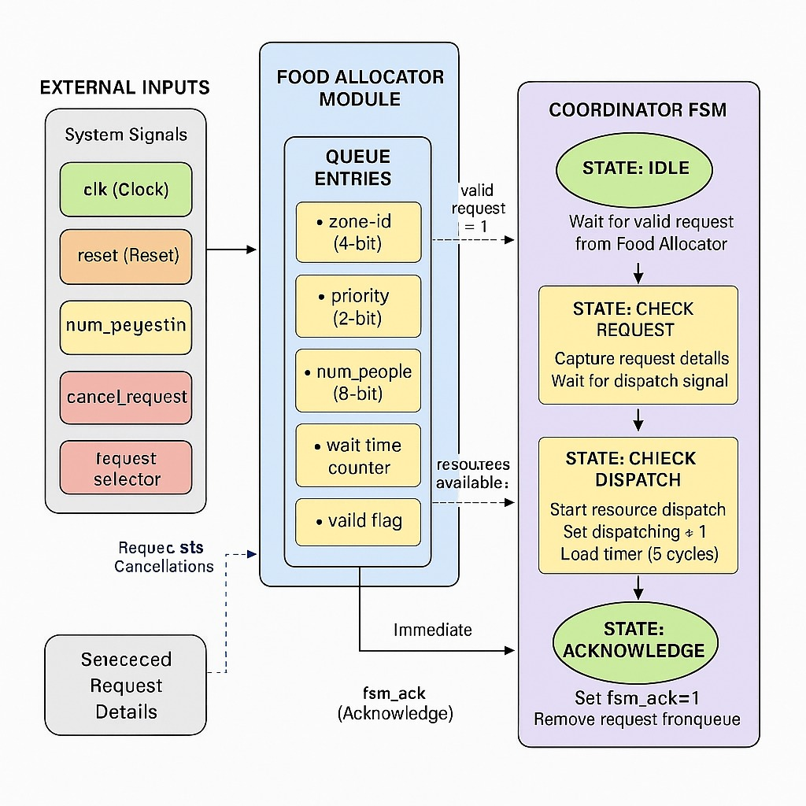

# ResQ-Manager: A Priority-Based Disaster Relief System

<!-- First Section -->
## Team Details
<details>
  <summary>Detail</summary>

  > Semester: 3rd Sem B. Tech. CSE

  > Section: S1

  > Team ID: S1-T2

  > Member-1: Pradyun Diwakar, 241CS141, pradyund.241cs141@nitk.edu.in

  > Member-2: Rudraksh Mahajan, 241CS150, rudrakshmahajan.241cs150@nitk.edu.in

  > Member-3: Tanay Nahta, 241CS159, tanaynahta.241cs159@nitk.edu.in
</details>

<!-- Second Section -->
## Abstract
<details>
  <summary>Detail</summary>
  
  > Disasters such as floods, earthquakes, and cyclones create urgent demands for relief resources like transport vehicles, food packets, and shelter space. Manual allocation of these resources often results in delays, inefficiencies, and unfair distribution. This project, titled ResQ-Manager, proposes a hardware-oriented digital system that manages disaster relief requests using priority-based scheduling and finite state machine (FSM) logic. The system integrates three modules: a Transport Scheduler, a Food Resource Allocator, and a Shelter Availability Checker. Each request is assigned a priority level (Normal, High, Emergency), and the system ensures that higher-priority zones receive resources first while also implementing fairness mechanisms to avoid starvation. The Coordinator FSM orchestrates communication between modules, checks resource availability, and updates outputs through LEDs, seven-segment displays, and optional LCD modules. By combining combinational and sequential logic, this system demonstrates how digital design can be applied to solve real-world problems. The proposed solution highlights concepts of queue management, priority arbitration, and hardware-friendly scheduling algorithms, making it both educational and socially impactful. The final system can be simulated in FPGA/Logisim and later scaled into IoT-enabled prototypes for actual disaster management use.
</details>

## Functional Block Diagram
<details>
  

  
</details>

<!-- Third Section -->
## Working
<details>
  <summary>Detail</summary>

  > Explain how your model works with the help of a functional table (compulsory) followed by the flowchart.
</details>

<!-- Fourth Section -->
## Logisim Circuit Diagram
<details>
  <summary>Detail</summary>
    

  > Update a neat logisim circuit diagram
</details>

<!-- Fifth Section -->
## Verilog Code

<details>
    <summary>Detail</summary>
    <details>
    <summary>Verilog Behavioral level code</summary>
      <details>
      <summary>Main FSM Behavioral level code</summary>
      ```
      /**
 * Module: Main_behavioral
 */
module Main_behavioral (
    // Inputs
    input wire         Clock,
    input wire         Insert,        // Button
    input wire         Serve,         // Button
    input wire         Reset_Queue,   // Pin
    input wire [7:0]   Zone,
    input wire [1:0]   Priority,
    input wire [1:0]   Resource_line,

    // Outputs
    output wire        Food_00,
    output wire        Shelter_01,
    output wire        Evacuation_10,
    
    output wire        Shelter_Full,
    output wire        Food_Full,
    output wire        Evac_Empty,
    
    output wire [7:0]  Output_Zone,
    output wire [1:0]  Output_Priority,
    
    // Pass-through outputs from diagram
    output wire        Shelter_Valid,
    output wire        Shelter_Boost,
    output wire        Food_Valid,
    output wire        Food_Boost
);

    // --- Internal Wires ---

    // Decoder Outputs
    wire w_food_req;
    wire w_shelter_req;
    wire w_evac_req;

    // Shelter Q Wires
    wire w_shelter_insert_en;
    wire w_shelter_serve_en;
    wire w_shelter_cancel_en;
    wire [1:0] w_shelter_priority;
    wire [7:0] w_shelter_zone;

    // Food Q Wires
    wire w_food_insert_en;
    wire w_food_serve_en;
    wire w_food_cancel_en;
    wire [1:0] w_food_priority;
    wire [7:0] w_food_zone;
    
    // Evac Q Wires
    wire w_evac_insert_en;
    wire w_evac_serve_en;
    wire [1:0] w_evac_priority;
    wire [7:0] w_evac_zone;

    // Final Selector Wires
    wire w_final_valid;
    wire w_final_boost;
    wire [1:0] w_final_priority;
    wire [7:0] w_final_zone;
    wire w_final_select_shelter; // 1=Shelter, 0=Food
    
    // MUX Control Wires
    wire w_evac_not_empty;
    wire [7:0] w_threshold_const = 8'h14; // Default 20 cycles


    // --- Logic Implementation ---

    // 1. Decoder
    assign Food_00       = (Resource_line == 2'b00);
    assign Shelter_01    = (Resource_line == 2'b01);
    assign Evacuation_10 = (Resource_line == 2'b10);
    
    // Alias for readability
    assign w_food_req    = Food_00;
    assign w_shelter_req = Shelter_01;
    assign w_evac_req    = Evacuation_10;

    // 2. Insertion Routing Logic
    assign w_shelter_insert_en = Insert & w_shelter_req;
    assign w_food_insert_en    = Insert & w_food_req;
    assign w_evac_insert_en    = Insert & w_evac_req;

    // 3. Cancellation Logic
    // An Evac(10) request also triggers a cancel event on Shelter and Food
    assign w_shelter_cancel_en = w_evac_req;
    assign w_food_cancel_en    = w_evac_req;
    
    // 4. MUX and Serve Control Logic (The "Evac-First" Brain)
    assign w_evac_not_empty = ~Evac_Empty;

    // The MUX select is controlled by whether the Evac Q has items
    // 1 (Not Empty) -> Select Evac Q
    // 0 (Empty)     -> Select Final_Selector's winner
    assign Output_Zone     = w_evac_not_empty ? w_evac_zone : w_final_zone;
    assign Output_Priority = w_evac_not_empty ? w_evac_priority : w_final_priority;

    // Route the 'Serve' signal
    assign w_evac_serve_en    = Serve & w_evac_not_empty;
    assign w_shelter_serve_en = Serve & ~w_evac_not_empty & w_final_select_shelter;
    assign w_food_serve_en    = Serve & ~w_evac_not_empty & ~w_final_select_shelter;


    // --- Component Instantiation ---

    // 1. Shelter Q
    priority_Queue_shelter shelter_module_inst (
        .clk           (Clock),
        .rst_n         (~Reset_Queue),
        .insert        (w_shelter_insert_en),
        .new_zone_id   (Zone),
        .new_priority  (Priority),
        .threshold     (w_threshold_const),
        .serve         (w_shelter_serve_en),
        .cancel_zone   (Zone),
        .cancel_en     (w_shelter_cancel_en),
        
        .to_fsm_zone_id(w_shelter_zone),
        .to_fsm_priority(w_shelter_priority),
        .to_fsm_boost  (Shelter_Boost),
        .to_fsm_valid  (Shelter_Valid),
        .queue_full    (Shelter_Full)
    );

    // 2. Food Q 
    priority_Queue_food food_module_inst (
        .clk           (Clock),
        .rst_n         (~Reset_Queue),
        .insert        (w_food_insert_en),
        .new_zone_id   (Zone),
        .new_priority  (Priority),
        .threshold     (w_threshold_const),
        .serve         (w_food_serve_en),
        .cancel_zone   (Zone),
        .cancel_en     (w_food_cancel_en),
        
        .to_fsm_zone_id(w_food_zone),
        .to_fsm_priority(w_food_priority),
        .to_fsm_boost  (Food_Boost),
        .to_fsm_valid  (Food_Valid),
        .queue_full    (Food_Full)
    );

    // 3. Evac Q (Simple FIFO)
    Evac_Queue_behavioral evac_queue_inst (
        .Main_Clock  (Clock),
        .Insert      (w_evac_insert_en),
        .Zone        (Zone),
        .Clear       (Reset_Queue),
        .Reset       (Reset_Queue),
        .Serve       (w_evac_serve_en),
        .Priority    (Priority),

        .Output_Zone   (w_evac_zone),
        .Output_Priority (w_evac_priority),
        .Empty       (Evac_Empty)
    );
    
    // 4. Final Selector (Shelter vs Food)
    Final_Selector_behavioral final_selector_inst (
        .Shelter_Valid    (Shelter_Valid),
        .Shelter_Boost    (Shelter_Boost),
        .Shelter_Priority (w_shelter_priority),
        .Shelter_Zone     (w_shelter_zone),
    
        .Food_Valid       (Food_Valid),
        .Food_Boost       (Food_Boost),
        .Food_Priority    (w_food_priority),
        .Food_Zone        (w_food_zone),

        .Out_Valid        (w_final_valid),
        .Out_Boost        (w_final_boost),
        .Out_Priority     (w_final_priority),
        .Out_Zone         (w_final_zone),
        
        .Select_Shelter   (w_final_select_shelter)
    );

endmodule
      ```
      </details>
      <details>
      <summary>Shelter Module Behavioral level code</summary>
        
    // SHELTER MODULE - BEHAVIORAL IMPLEMENTATION

    // MODULE: Request Register (Behavioral)
    module request_register_behavioral (
    input wire clk,
    input wire rst_n,
    input wire write_en,
    input wire [7:0] zone_id_in,
    input wire [1:0] priority_in,
    input wire increment_wait,
    input wire set_boost,
    input wire clear,
    output reg [7:0] zone_id_out,
    output reg [1:0] priority_out,
    output reg [7:0] waiting_time_out,
    output reg valid_out,
    output reg boost_out
    );

    always @(posedge clk or negedge rst_n) begin
        if (!rst_n) begin
            zone_id_out <= 8'd0;
            priority_out <= 2'd0;
            waiting_time_out <= 8'd0;
            valid_out <= 1'b0;
            boost_out <= 1'b0;
        end
        else if (clear) begin
            zone_id_out <= 8'd0;
            priority_out <= 2'd0;
            waiting_time_out <= 8'd0;
            valid_out <= 1'b0;
            boost_out <= 1'b0;
        end
        else begin
            if (write_en) begin
                zone_id_out <= zone_id_in;
                priority_out <= priority_in;
                waiting_time_out <= 8'd0;
                valid_out <= 1'b1;
                boost_out <= 1'b0;
            end
            else begin
                if (increment_wait && valid_out) begin
                    waiting_time_out <= waiting_time_out + 8'd1;
                end
                
                if (set_boost) begin
                    boost_out <= 1'b1;
                end
            end
        end
    end

    endmodule

    // MODULE: Threshold Comparator (Behavioral)
    module threshold_comparator_behavioral (
    input wire [7:0] waiting_time,
    input wire [7:0] threshold,
    input wire valid,
    output reg should_boost
    );

    always @(*) begin
        if (valid && (waiting_time >= threshold))
            should_boost = 1'b1;
        else
            should_boost = 1'b0;
    end

    endmodule

    // MODULE: Priority Encoder 2-to-1 (Behavioral)
    module priority_encoder_2to1_behavioral (
    input wire [7:0] a_zone_id,
    input wire [1:0] a_priority,
    input wire [7:0] a_waiting_time,
    input wire a_boost,
    input wire a_valid,
    
    input wire [7:0] b_zone_id,
    input wire [1:0] b_priority,
    input wire [7:0] b_waiting_time,
    input wire b_boost,
    input wire b_valid,
    
    output reg [7:0] out_zone_id,
    output reg [1:0] out_priority,
    output reg [7:0] out_waiting_time,
    output reg out_boost,
    output reg out_valid,
    output reg select_a
    );

    always @(*) begin
        // Default: select nothing
        select_a = 1'b0;
        out_zone_id = 8'd0;
        out_priority = 2'd0;
        out_waiting_time = 8'd0;
        out_boost = 1'b0;
        out_valid = 1'b0;
        
        // Priority selection logic
        if (!a_valid && !b_valid) begin
            // Both invalid
            select_a = 1'b0;
            out_valid = 1'b0;
        end
        else if (a_valid && !b_valid) begin
            // Only A valid
            select_a = 1'b1;
            out_zone_id = a_zone_id;
            out_priority = a_priority;
            out_waiting_time = a_waiting_time;
            out_boost = a_boost;
            out_valid = 1'b1;
        end
        else if (!a_valid && b_valid) begin
            // Only B valid
            select_a = 1'b0;
            out_zone_id = b_zone_id;
            out_priority = b_priority;
            out_waiting_time = b_waiting_time;
            out_boost = b_boost;
            out_valid = 1'b1;
        end
        else begin
            // Both valid - apply priority rules
            if (a_boost && !b_boost) begin
                // A boosted, B not
                select_a = 1'b1;
                out_zone_id = a_zone_id;
                out_priority = a_priority;
                out_waiting_time = a_waiting_time;
                out_boost = a_boost;
                out_valid = 1'b1;
            end
            else if (!a_boost && b_boost) begin
                // B boosted, A not
                select_a = 1'b0;
                out_zone_id = b_zone_id;
                out_priority = b_priority;
                out_waiting_time = b_waiting_time;
                out_boost = b_boost;
                out_valid = 1'b1;
            end
            else begin
                // Both boosted or both not boosted
                if (a_priority > b_priority) begin
                    // A higher priority
                    select_a = 1'b1;
                    out_zone_id = a_zone_id;
                    out_priority = a_priority;
                    out_waiting_time = a_waiting_time;
                    out_boost = a_boost;
                    out_valid = 1'b1;
                end
                else if (b_priority > a_priority) begin
                    // B higher priority
                    select_a = 1'b0;
                    out_zone_id = b_zone_id;
                    out_priority = b_priority;
                    out_waiting_time = b_waiting_time;
                    out_boost = b_boost;
                    out_valid = 1'b1;
                end
                else begin
                    // Same priority - use FIFO (older = higher waiting time)
                    if (a_waiting_time >= b_waiting_time) begin
                        select_a = 1'b1;
                        out_zone_id = a_zone_id;
                        out_priority = a_priority;
                        out_waiting_time = a_waiting_time;
                        out_boost = a_boost;
                        out_valid = 1'b1;
                    end
                    else begin
                        select_a = 1'b0;
                        out_zone_id = b_zone_id;
                        out_priority = b_priority;
                        out_waiting_time = b_waiting_time;
                        out_boost = b_boost;
                        out_valid = 1'b1;
                    end
                end
            end
        end
    end

    endmodule

    // MODULE: Serve Decoder (Behavioral)
    module serve_decoder_behavioral (
    input wire serve,
    input wire [1:0] selected_index,
    output reg serve_0,
    output reg serve_1,
    output reg serve_2,
    output reg serve_3
    );

    always @(*) begin
        serve_0 = 1'b0;
        serve_1 = 1'b0;
        serve_2 = 1'b0;
        serve_3 = 1'b0;
        
        if (serve) begin
            case (selected_index)
                2'b00: serve_0 = 1'b1;
                2'b01: serve_1 = 1'b1;
                2'b10: serve_2 = 1'b1;
                2'b11: serve_3 = 1'b1;
            endcase
        end
    end

    endmodule

    // MODULE: Queue Storage (Behavioral)
    module queue_storage_behavioral (
    input wire clk,
    input wire rst_n,
    input wire insert,
    input wire [7:0] new_zone_id,
    input wire [1:0] new_priority,
    input wire serve,
    input wire [1:0] selected_index,
    input wire [7:0] cancel_zone,
    input wire cancel_en,
    input wire [7:0] threshold,
    
    output wire [7:0] entry0_zone_id,
    output wire [1:0] entry0_priority,
    output wire [7:0] entry0_waiting_time,
    output wire entry0_boost,
    output wire entry0_valid,
    
    output wire [7:0] entry1_zone_id,
    output wire [1:0] entry1_priority,
    output wire [7:0] entry1_waiting_time,
    output wire entry1_boost,
    output wire entry1_valid,
    
    output wire [7:0] entry2_zone_id,
    output wire [1:0] entry2_priority,
    output wire [7:0] entry2_waiting_time,
    output wire entry2_boost,
    output wire entry2_valid,
    
    output wire [7:0] entry3_zone_id,
    output wire [1:0] entry3_priority,
    output wire [7:0] entry3_waiting_time,
    output wire entry3_boost,
    output wire entry3_valid,
    
    output wire queue_full
    );

    // Write enable signals
    reg write_en_0, write_en_1, write_en_2, write_en_3;
    
    // Serve signals
    wire serve_0, serve_1, serve_2, serve_3;
    
    // Clear signals
    reg clear_0, clear_1, clear_2, clear_3;
    
    // Boost signals
    wire should_boost_0, should_boost_1, should_boost_2, should_boost_3;
    
    // Write enable logic
    always @(*) begin
        write_en_0 = 1'b0;
        write_en_1 = 1'b0;
        write_en_2 = 1'b0;
        write_en_3 = 1'b0;
        
        if (insert) begin
            if (!entry0_valid)
                write_en_0 = 1'b1;
            else if (!entry1_valid)
                write_en_1 = 1'b1;
            else if (!entry2_valid)
                write_en_2 = 1'b1;
            else if (!entry3_valid)
                write_en_3 = 1'b1;
        end
    end
    
    // Serve decoder
    serve_decoder_behavioral serve_dec (
        .serve(serve),
        .selected_index(selected_index),
        .serve_0(serve_0),
        .serve_1(serve_1),
        .serve_2(serve_2),
        .serve_3(serve_3)
    );
    
    // Clear logic (serve or cancel)
    always @(*) begin
        clear_0 = serve_0 | (cancel_en & (entry0_zone_id == cancel_zone) & entry0_valid);
        clear_1 = serve_1 | (cancel_en & (entry1_zone_id == cancel_zone) & entry1_valid);
        clear_2 = serve_2 | (cancel_en & (entry2_zone_id == cancel_zone) & entry2_valid);
        clear_3 = serve_3 | (cancel_en & (entry3_zone_id == cancel_zone) & entry3_valid);
    end
    
    // Request registers
    request_register_behavioral reg0 (
        .clk(clk),
        .rst_n(rst_n),
        .write_en(write_en_0),
        .zone_id_in(new_zone_id),
        .priority_in(new_priority),
        .increment_wait(1'b1),
        .set_boost(should_boost_0),
        .clear(clear_0),
        .zone_id_out(entry0_zone_id),
        .priority_out(entry0_priority),
        .waiting_time_out(entry0_waiting_time),
        .valid_out(entry0_valid),
        .boost_out(entry0_boost)
    );
    
    request_register_behavioral reg1 (
        .clk(clk),
        .rst_n(rst_n),
        .write_en(write_en_1),
        .zone_id_in(new_zone_id),
        .priority_in(new_priority),
        .increment_wait(1'b1),
        .set_boost(should_boost_1),
        .clear(clear_1),
        .zone_id_out(entry1_zone_id),
        .priority_out(entry1_priority),
        .waiting_time_out(entry1_waiting_time),
        .valid_out(entry1_valid),
        .boost_out(entry1_boost)
    );
    
    request_register_behavioral reg2 (
        .clk(clk),
        .rst_n(rst_n),
        .write_en(write_en_2),
        .zone_id_in(new_zone_id),
        .priority_in(new_priority),
        .increment_wait(1'b1),
        .set_boost(should_boost_2),
        .clear(clear_2),
        .zone_id_out(entry2_zone_id),
        .priority_out(entry2_priority),
        .waiting_time_out(entry2_waiting_time),
        .valid_out(entry2_valid),
        .boost_out(entry2_boost)
    );
    
    request_register_behavioral reg3 (
        .clk(clk),
        .rst_n(rst_n),
        .write_en(write_en_3),
        .zone_id_in(new_zone_id),
        .priority_in(new_priority),
        .increment_wait(1'b1),
        .set_boost(should_boost_3),
        .clear(clear_3),
        .zone_id_out(entry3_zone_id),
        .priority_out(entry3_priority),
        .waiting_time_out(entry3_waiting_time),
        .valid_out(entry3_valid),
        .boost_out(entry3_boost)
    );
    
    // Threshold comparators
    threshold_comparator_behavioral comp0 (
        .waiting_time(entry0_waiting_time),
        .threshold(threshold),
        .valid(entry0_valid),
        .should_boost(should_boost_0)
    );
    
    threshold_comparator_behavioral comp1 (
        .waiting_time(entry1_waiting_time),
        .threshold(threshold),
        .valid(entry1_valid),
        .should_boost(should_boost_1)
    );
    
    threshold_comparator_behavioral comp2 (
        .waiting_time(entry2_waiting_time),
        .threshold(threshold),
        .valid(entry2_valid),
        .should_boost(should_boost_2)
    );
    
    threshold_comparator_behavioral comp3 (
        .waiting_time(entry3_waiting_time),
        .threshold(threshold),
        .valid(entry3_valid),
        .should_boost(should_boost_3)
    );
    
    // Queue full signal
    assign queue_full = entry0_valid & entry1_valid & entry2_valid & entry3_valid;

    endmodule

    // MODULE: Priority Selector Tree (Behavioral)
    module priority_selector_tree_behavioral (
    input wire [7:0] entry0_zone_id,
    input wire [1:0] entry0_priority,
    input wire [7:0] entry0_waiting_time,
    input wire entry0_boost,
    input wire entry0_valid,
    
    input wire [7:0] entry1_zone_id,
    input wire [1:0] entry1_priority,
    input wire [7:0] entry1_waiting_time,
    input wire entry1_boost,
    input wire entry1_valid,
    
    input wire [7:0] entry2_zone_id,
    input wire [1:0] entry2_priority,
    input wire [7:0] entry2_waiting_time,
    input wire entry2_boost,
    input wire entry2_valid,
    
    input wire [7:0] entry3_zone_id,
    input wire [1:0] entry3_priority,
    input wire [7:0] entry3_waiting_time,
    input wire entry3_boost,
    input wire entry3_valid,
    
    output wire [7:0] selected_zone_id,
    output wire [1:0] selected_priority,
    output wire [7:0] selected_waiting_time,
    output wire selected_boost,
    output wire selected_valid,
    output wire [1:0] selected_index
    );

    wire [7:0] winner_01_zone, winner_23_zone;
    wire [1:0] winner_01_pri, winner_23_pri;
    wire [7:0] winner_01_wait, winner_23_wait;
    wire winner_01_boost, winner_23_boost;
    wire winner_01_valid, winner_23_valid;
    wire select_01_a, select_23_a, select_final_a;
    
    // First level comparisons
    priority_encoder_2to1_behavioral comp_01 (
        .a_zone_id(entry0_zone_id),
        .a_priority(entry0_priority),
        .a_waiting_time(entry0_waiting_time),
        .a_boost(entry0_boost),
        .a_valid(entry0_valid),
        .b_zone_id(entry1_zone_id),
        .b_priority(entry1_priority),
        .b_waiting_time(entry1_waiting_time),
        .b_boost(entry1_boost),
        .b_valid(entry1_valid),
        .out_zone_id(winner_01_zone),
        .out_priority(winner_01_pri),
        .out_waiting_time(winner_01_wait),
        .out_boost(winner_01_boost),
        .out_valid(winner_01_valid),
        .select_a(select_01_a)
    );
    
    priority_encoder_2to1_behavioral comp_23 (
        .a_zone_id(entry2_zone_id),
        .a_priority(entry2_priority),
        .a_waiting_time(entry2_waiting_time),
        .a_boost(entry2_boost),
        .a_valid(entry2_valid),
        .b_zone_id(entry3_zone_id),
        .b_priority(entry3_priority),
        .b_waiting_time(entry3_waiting_time),
        .b_boost(entry3_boost),
        .b_valid(entry3_valid),
        .out_zone_id(winner_23_zone),
        .out_priority(winner_23_pri),
        .out_waiting_time(winner_23_wait),
        .out_boost(winner_23_boost),
        .out_valid(winner_23_valid),
        .select_a(select_23_a)
    );
    
    // Final comparison
    priority_encoder_2to1_behavioral comp_final (
        .a_zone_id(winner_01_zone),
        .a_priority(winner_01_pri),
        .a_waiting_time(winner_01_wait),
        .a_boost(winner_01_boost),
        .a_valid(winner_01_valid),
        .b_zone_id(winner_23_zone),
        .b_priority(winner_23_pri),
        .b_waiting_time(winner_23_wait),
        .b_boost(winner_23_boost),
        .b_valid(winner_23_valid),
        .out_zone_id(selected_zone_id),
        .out_priority(selected_priority),
        .out_waiting_time(selected_waiting_time),
        .out_boost(selected_boost),
        .out_valid(selected_valid),
        .select_a(select_final_a)
    );
    
    // Index tracking
    reg [1:0] index_01, index_23;
    
    always @(*) begin
        if (select_01_a)
            index_01 = 2'b00;
        else
            index_01 = 2'b01;
            
        if (select_23_a)
            index_23 = 2'b10;
        else
            index_23 = 2'b11;
    end
    
    assign selected_index = select_final_a ? index_01 : index_23;

    endmodule

    // MODULE: Shelter Module Top Level (Behavioral)
    module shelter_module_behavioral (
    input wire clk,
    input wire rst_n,
    input wire insert,
    input wire [7:0] new_zone_id,
    input wire [1:0] new_priority,
    input wire [7:0] threshold,
    input wire serve,
    input wire [7:0] cancel_zone,
    input wire cancel_en,
    
    output wire [7:0] to_fsm_zone_id,
    output wire [1:0] to_fsm_priority,
    output wire to_fsm_boost,
    output wire to_fsm_valid,
    output wire queue_full
    );

    wire [7:0] entry0_zone_id, entry1_zone_id, entry2_zone_id, entry3_zone_id;
    wire [1:0] entry0_priority, entry1_priority, entry2_priority, entry3_priority;
    wire [7:0] entry0_waiting_time, entry1_waiting_time, entry2_waiting_time, entry3_waiting_time;
    wire entry0_boost, entry1_boost, entry2_boost, entry3_boost;
    wire entry0_valid, entry1_valid, entry2_valid, entry3_valid;
    wire [1:0] selected_index;
    wire [7:0] selected_waiting_time;
    
    queue_storage_behavioral queue (
        .clk(clk),
        .rst_n(rst_n),
        .insert(insert),
        .new_zone_id(new_zone_id),
        .new_priority(new_priority),
        .serve(serve),
        .selected_index(selected_index),
        .cancel_zone(cancel_zone),
        .cancel_en(cancel_en),
        .threshold(threshold),
        .entry0_zone_id(entry0_zone_id),
        .entry0_priority(entry0_priority),
        .entry0_waiting_time(entry0_waiting_time),
        .entry0_boost(entry0_boost),
        .entry0_valid(entry0_valid),
        .entry1_zone_id(entry1_zone_id),
        .entry1_priority(entry1_priority),
        .entry1_waiting_time(entry1_waiting_time),
        .entry1_boost(entry1_boost),
        .entry1_valid(entry1_valid),
        .entry2_zone_id(entry2_zone_id),
        .entry2_priority(entry2_priority),
        .entry2_waiting_time(entry2_waiting_time),
        .entry2_boost(entry2_boost),
        .entry2_valid(entry2_valid),
        .entry3_zone_id(entry3_zone_id),
        .entry3_priority(entry3_priority),
        .entry3_waiting_time(entry3_waiting_time),
        .entry3_boost(entry3_boost),
        .entry3_valid(entry3_valid),
        .queue_full(queue_full)
    );
    
    priority_selector_tree_behavioral selector (
        .entry0_zone_id(entry0_zone_id),
        .entry0_priority(entry0_priority),
        .entry0_waiting_time(entry0_waiting_time),
        .entry0_boost(entry0_boost),
        .entry0_valid(entry0_valid),
        .entry1_zone_id(entry1_zone_id),
        .entry1_priority(entry1_priority),
        .entry1_waiting_time(entry1_waiting_time),
        .entry1_boost(entry1_boost),
        .entry1_valid(entry1_valid),
        .entry2_zone_id(entry2_zone_id),
        .entry2_priority(entry2_priority),
        .entry2_waiting_time(entry2_waiting_time),
        .entry2_boost(entry2_boost),
        .entry2_valid(entry2_valid),
        .entry3_zone_id(entry3_zone_id),
        .entry3_priority(entry3_priority),
        .entry3_waiting_time(entry3_waiting_time),
        .entry3_boost(entry3_boost),
        .entry3_valid(entry3_valid),
        .selected_zone_id(to_fsm_zone_id),
        .selected_priority(to_fsm_priority),
        .selected_waiting_time(selected_waiting_time),
        .selected_boost(to_fsm_boost),
        .selected_valid(to_fsm_valid),
        .selected_index(selected_index)
    );

    endmodule
   </details>
      <details>
      <summary>Food Module Behavioral level code</summary>
        
    // ============================================================================
    // MODULE 2: priority_queue
    // ============================================================================

    // ----------------------------------------------------------------------------
    // MODULE: Request Register (Behavioral)
    // ----------------------------------------------------------------------------
    module request_register_beh_food (
    input wire clk,
    input wire rst_n,
    input wire write_en,
    input wire [7:0] zone_id_in,
    input wire [1:0] priority_in,
    input wire increment_wait,
    input wire set_boost,
    input wire clear,
    output reg [7:0] zone_id_out,
    output reg [1:0] priority_out,
    output reg [7:0] waiting_time_out,
    output reg valid_out,
    output reg boost_out
    );

    always @(posedge clk or negedge rst_n) begin
        if (!rst_n) begin
            zone_id_out <= 8'd0;
            priority_out <= 2'd0;
            waiting_time_out <= 8'd0;
            valid_out <= 1'b0;
            boost_out <= 1'b0;
        end
        else if (clear) begin
            zone_id_out <= 8'd0;
            priority_out <= 2'd0;
            waiting_time_out <= 8'd0;
            valid_out <= 1'b0;
            boost_out <= 1'b0;
        end
        else begin
            if (write_en) begin
                zone_id_out <= zone_id_in;
                priority_out <= priority_in;
                waiting_time_out <= 8'd0;
                valid_out <= 1'b1;
                boost_out <= 1'b0;
            end
            else begin
                if (increment_wait && valid_out) begin
                    waiting_time_out <= waiting_time_out + 8'd1;
                end
                
                if (set_boost) begin
                    boost_out <= 1'b1;
                end
            end
        end
    end

    endmodule

    // ----------------------------------------------------------------------------
    // MODULE: Threshold Comparator (Behavioral)
    // ----------------------------------------------------------------------------
    module threshold_comparator_beh_food (
    input wire [7:0] waiting_time,
    input wire [7:0] threshold,
    input wire valid,
    output reg should_boost
    );

    always @(*) begin
        if (valid && (waiting_time >= threshold))
            should_boost = 1'b1;
        else
            should_boost = 1'b0;
    end

    endmodule

    // ----------------------------------------------------------------------------
    // MODULE: Priority Encoder 2-to-1 (Behavioral)
    // ----------------------------------------------------------------------------
    module priority_encoder_2to1_beh_food (
    input wire [7:0] a_zone_id,
    input wire [1:0] a_priority,
    input wire [7:0] a_waiting_time,
    input wire a_boost,
    input wire a_valid,
    
    input wire [7:0] b_zone_id,
    input wire [1:0] b_priority,
    input wire [7:0] b_waiting_time,
    input wire b_boost,
    input wire b_valid,
    
    output reg [7:0] out_zone_id,
    output reg [1:0] out_priority,
    output reg [7:0] out_waiting_time,
    output reg out_boost,
    output reg out_valid,
    output reg select_a
    );

    always @(*) begin
        // Default: select nothing
        select_a = 1'b0;
        out_zone_id = 8'd0;
        out_priority = 2'd0;
        out_waiting_time = 8'd0;
        out_boost = 1'b0;
        out_valid = 1'b0;
        
        // Priority selection logic
        if (!a_valid && !b_valid) begin
            // Both invalid
            select_a = 1'b0;
            out_valid = 1'b0;
        end
        else if (a_valid && !b_valid) begin
            // Only A valid
            select_a = 1'b1;
            out_zone_id = a_zone_id;
            out_priority = a_priority;
            out_waiting_time = a_waiting_time;
            out_boost = a_boost;
            out_valid = 1'b1;
        end
        else if (!a_valid && b_valid) begin
            // Only B valid
            select_a = 1'b0;
            out_zone_id = b_zone_id;
            out_priority = b_priority;
            out_waiting_time = b_waiting_time;
            out_boost = b_boost;
            out_valid = 1'b1;
        end
        else begin
            // Both valid - apply priority rules
            if (a_boost && !b_boost) begin
                // A boosted, B not
                select_a = 1'b1;
                out_zone_id = a_zone_id;
                out_priority = a_priority;
                out_waiting_time = a_waiting_time;
                out_boost = a_boost;
                out_valid = 1'b1;
            end
            else if (!a_boost && b_boost) begin
                // B boosted, A not
                select_a = 1'b0;
                out_zone_id = b_zone_id;
                out_priority = b_priority;
                out_waiting_time = b_waiting_time;
                out_boost = b_boost;
                out_valid = 1'b1;
            end
            else begin
                // Both boosted or both not boosted
                if (a_priority > b_priority) begin
                    // A higher priority
                    select_a = 1'b1;
                    out_zone_id = a_zone_id;
                    out_priority = a_priority;
                    out_waiting_time = a_waiting_time;
                    out_boost = a_boost;
                    out_valid = 1'b1;
                end
                else if (b_priority > a_priority) begin
                    // B higher priority
                    select_a = 1'b0;
                    out_zone_id = b_zone_id;
                    out_priority = b_priority;
                    out_waiting_time = b_waiting_time;
                    out_boost = b_boost;
                    out_valid = 1'b1;
                end
                else begin
                    // Same priority - use FIFO (older = higher waiting time)
                    if (a_waiting_time >= b_waiting_time) begin
                        select_a = 1'b1;
                        out_zone_id = a_zone_id;
                        out_priority = a_priority;
                        out_waiting_time = a_waiting_time;
                        out_boost = a_boost;
                        out_valid = 1'b1;
                    end
                    else begin
                        select_a = 1'b0;
                        out_zone_id = b_zone_id;
                        out_priority = b_priority;
                        out_waiting_time = b_waiting_time;
                        out_boost = b_boost;
                        out_valid = 1'b1;
                    end
                end
            end
        end
    end

    endmodule

    // ----------------------------------------------------------------------------
    // MODULE: Serve Decoder (Behavioral)
    // ----------------------------------------------------------------------------
    module serve_decoder_beh_food (
    input wire serve,
    input wire [1:0] selected_index,
    output reg serve_0,
    output reg serve_1,
    output reg serve_2,
    output reg serve_3
    );

    always @(*) begin
        serve_0 = 1'b0;
        serve_1 = 1'b0;
        serve_2 = 1'b0;
        serve_3 = 1'b0;
        
        if (serve) begin
            case (selected_index)
                2'b00: serve_0 = 1'b1;
                2'b01: serve_1 = 1'b1;
                2'b10: serve_2 = 1'b1;
                2'b11: serve_3 = 1'b1;
            endcase
        end
    end

    endmodule

    // ----------------------------------------------------------------------------
    // MODULE: Queue Storage (Behavioral)
    // ----------------------------------------------------------------------------
    module queue_storage_beh_food (
    input wire clk,
    input wire rst_n,
    input wire insert,
    input wire [7:0] new_zone_id,
    input wire [1:0] new_priority,
    input wire serve,
    input wire [1:0] selected_index,
    input wire [7:0] cancel_zone,
    input wire cancel_en,
    input wire [7:0] threshold,
    
    output wire [7:0] entry0_zone_id,
    output wire [1:0] entry0_priority,
    output wire [7:0] entry0_waiting_time,
    output wire entry0_boost,
    output wire entry0_valid,
    
    output wire [7:0] entry1_zone_id,
    output wire [1:0] entry1_priority,
    output wire [7:0] entry1_waiting_time,
    output wire entry1_boost,
    output wire entry1_valid,
    
    output wire [7:0] entry2_zone_id,
    output wire [1:0] entry2_priority,
    output wire [7:0] entry2_waiting_time,
    output wire entry2_boost,
    output wire entry2_valid,
    
    output wire [7:0] entry3_zone_id,
    output wire [1:0] entry3_priority,
    output wire [7:0] entry3_waiting_time,
    output wire entry3_boost,
    output wire entry3_valid,
    
    output wire queue_full
    );

    // Write enable signals
    reg write_en_0, write_en_1, write_en_2, write_en_3;
    
    // Serve signals
    wire serve_0, serve_1, serve_2, serve_3;
    
    // Clear signals
    reg clear_0, clear_1, clear_2, clear_3;
    
    // Boost signals
    wire should_boost_0, should_boost_1, should_boost_2, should_boost_3;
    
    // Write enable logic
    always @(*) begin
        write_en_0 = 1'b0;
        write_en_1 = 1'b0;
        write_en_2 = 1'b0;
        write_en_3 = 1'b0;
        
        if (insert) begin
            if (!entry0_valid)
                write_en_0 = 1'b1;
            else if (!entry1_valid)
                write_en_1 = 1'b1;
            else if (!entry2_valid)
                write_en_2 = 1'b1;
            else if (!entry3_valid)
                write_en_3 = 1'b1;
        end
    end
    
    // Serve decoder
    serve_decoder_beh_food serve_dec (
        .serve(serve),
        .selected_index(selected_index),
        .serve_0(serve_0),
        .serve_1(serve_1),
        .serve_2(serve_2),
        .serve_3(serve_3)
    );
    
    // Clear logic (serve or cancel)
    always @(*) begin
        clear_0 = serve_0 | (cancel_en & (entry0_zone_id == cancel_zone) & entry0_valid);
        clear_1 = serve_1 | (cancel_en & (entry1_zone_id == cancel_zone) & entry1_valid);
        clear_2 = serve_2 | (cancel_en & (entry2_zone_id == cancel_zone) & entry2_valid);
        clear_3 = serve_3 | (cancel_en & (entry3_zone_id == cancel_zone) & entry3_valid);
    end
    
    // Request registers
    request_register_beh_food reg0 (
        .clk(clk),
        .rst_n(rst_n),
        .write_en(write_en_0),
        .zone_id_in(new_zone_id),
        .priority_in(new_priority),
        .increment_wait(1'b1),
        .set_boost(should_boost_0),
        .clear(clear_0),
        .zone_id_out(entry0_zone_id),
        .priority_out(entry0_priority),
        .waiting_time_out(entry0_waiting_time),
        .valid_out(entry0_valid),
        .boost_out(entry0_boost)
    );
    
    request_register_beh_food reg1 (
        .clk(clk),
        .rst_n(rst_n),
        .write_en(write_en_1),
        .zone_id_in(new_zone_id),
        .priority_in(new_priority),
        .increment_wait(1'b1),
        .set_boost(should_boost_1),
        .clear(clear_1),
        .zone_id_out(entry1_zone_id),
        .priority_out(entry1_priority),
        .waiting_time_out(entry1_waiting_time),
        .valid_out(entry1_valid),
        .boost_out(entry1_boost)
    );
    
    request_register_beh_food reg2 (
        .clk(clk),
        .rst_n(rst_n),
        .write_en(write_en_2),
        .zone_id_in(new_zone_id),
        .priority_in(new_priority),
        .increment_wait(1'b1),
        .set_boost(should_boost_2),
        .clear(clear_2),
        .zone_id_out(entry2_zone_id),
        .priority_out(entry2_priority),
        .waiting_time_out(entry2_waiting_time),
        .valid_out(entry2_valid),
        .boost_out(entry2_boost)
    );
    
    request_register_beh_food reg3 (
        .clk(clk),
        .rst_n(rst_n),
        .write_en(write_en_3),
        .zone_id_in(new_zone_id),
        .priority_in(new_priority),
        .increment_wait(1'b1),
        .set_boost(should_boost_3),
        .clear(clear_3),
        .zone_id_out(entry3_zone_id),
        .priority_out(entry3_priority),
        .waiting_time_out(entry3_waiting_time),
        .valid_out(entry3_valid),
        .boost_out(entry3_boost)
    );
    
    // Threshold comparators
    threshold_comparator_beh_food comp0 (
        .waiting_time(entry0_waiting_time),
        .threshold(threshold),
        .valid(entry0_valid),
        .should_boost(should_boost_0)
    );
    
    threshold_comparator_beh_food comp1 (
        .waiting_time(entry1_waiting_time),
        .threshold(threshold),
        .valid(entry1_valid),
        .should_boost(should_boost_1)
    );
    
    threshold_comparator_beh_food comp2 (
        .waiting_time(entry2_waiting_time),
        .threshold(threshold),
        .valid(entry2_valid),
        .should_boost(should_boost_2)
    );
    
    threshold_comparator_beh_food comp3 (
        .waiting_time(entry3_waiting_time),
        .threshold(threshold),
        .valid(entry3_valid),
        .should_boost(should_boost_3)
    );
    
    // Queue full signal
    assign queue_full = entry0_valid & entry1_valid & entry2_valid & entry3_valid;

    endmodule

    // ----------------------------------------------------------------------------
    // MODULE: Priority Selector Tree (Behavioral)
    // ----------------------------------------------------------------------------
    module priority_selector_tree_beh_food (
    input wire [7:0] entry0_zone_id,
    input wire [1:0] entry0_priority,
    input wire [7:0] entry0_waiting_time,
    input wire entry0_boost,
    input wire entry0_valid,
    
    input wire [7:0] entry1_zone_id,
    input wire [1:0] entry1_priority,
    input wire [7:0] entry1_waiting_time,
    input wire entry1_boost,
    input wire entry1_valid,
    
    input wire [7:0] entry2_zone_id,
    input wire [1:0] entry2_priority,
    input wire [7:0] entry2_waiting_time,
    input wire entry2_boost,
    input wire entry2_valid,
    
    input wire [7:0] entry3_zone_id,
    input wire [1:0] entry3_priority,
    input wire [7:0] entry3_waiting_time,
    input wire entry3_boost,
    input wire entry3_valid,
    
    output wire [7:0] selected_zone_id,
    output wire [1:0] selected_priority,
    output wire [7:0] selected_waiting_time,
    output wire selected_boost,
    output wire selected_valid,
    output wire [1:0] selected_index
    );

    wire [7:0] winner_01_zone, winner_23_zone;
    wire [1:0] winner_01_pri, winner_23_pri;
    wire [7:0] winner_01_wait, winner_23_wait;
    wire winner_01_boost, winner_23_boost;
    wire winner_01_valid, winner_23_valid;
    wire select_01_a, select_23_a, select_final_a;
    
    // First level comparisons
    priority_encoder_2to1_beh_food comp_01 (
        .a_zone_id(entry0_zone_id),
        .a_priority(entry0_priority),
        .a_waiting_time(entry0_waiting_time),
        .a_boost(entry0_boost),
        .a_valid(entry0_valid),
        .b_zone_id(entry1_zone_id),
        .b_priority(entry1_priority),
        .b_waiting_time(entry1_waiting_time),
        .b_boost(entry1_boost),
        .b_valid(entry1_valid),
        .out_zone_id(winner_01_zone),
        .out_priority(winner_01_pri),
        .out_waiting_time(winner_01_wait),
        .out_boost(winner_01_boost),
        .out_valid(winner_01_valid),
        .select_a(select_01_a)
    );
    
    priority_encoder_2to1_beh_food comp_23 (
        .a_zone_id(entry2_zone_id),
        .a_priority(entry2_priority),
        .a_waiting_time(entry2_waiting_time),
        .a_boost(entry2_boost),
        .a_valid(entry2_valid),
        .b_zone_id(entry3_zone_id),
        .b_priority(entry3_priority),
        .b_waiting_time(entry3_waiting_time),
        .b_boost(entry3_boost),
        .b_valid(entry3_valid),
        .out_zone_id(winner_23_zone),
        .out_priority(winner_23_pri),
        .out_waiting_time(winner_23_wait),
        .out_boost(winner_23_boost),
        .out_valid(winner_23_valid),
        .select_a(select_23_a)
    );
    
    // Final comparison
    priority_encoder_2to1_beh_food comp_final (
        .a_zone_id(winner_01_zone),
        .a_priority(winner_01_pri),
        .a_waiting_time(winner_01_wait),
        .a_boost(winner_01_boost),
        .a_valid(winner_01_valid),
        .b_zone_id(winner_23_zone),
        .b_priority(winner_23_pri),
        .b_waiting_time(winner_23_wait),
        .b_boost(winner_23_boost),
        .b_valid(winner_23_valid),
        .out_zone_id(selected_zone_id),
        .out_priority(selected_priority),
        .out_waiting_time(selected_waiting_time),
        .out_boost(selected_boost),
        .out_valid(selected_valid),
        .select_a(select_final_a)
    );
    
    // Index tracking
    reg [1:0] index_01, index_23;
    
    always @(*) begin
        if (select_01_a)
            index_01 = 2'b00;
        else
            index_01 = 2'b01;
            
        if (select_23_a)
            index_23 = 2'b10;
        else
            index_23 = 2'b11;
    end
    
    assign selected_index = select_final_a ? index_01 : index_23;

    endmodule

    // ----------------------------------------------------------------------------
    // MODULE: Complex Priority Queue (Top Level)
    // ----------------------------------------------------------------------------
    module priority_Queue_food (
    input wire clk,
    input wire rst_n,
    input wire insert,
    input wire [7:0] new_zone_id,
    input wire [1:0] new_priority,
    input wire [7:0] threshold,
    input wire serve,
    input wire [7:0] cancel_zone,
    input wire cancel_en,
    
    output wire [7:0] to_fsm_zone_id,
    output wire [1:0] to_fsm_priority,
    output wire to_fsm_boost,
    output wire to_fsm_valid,
    output wire queue_full
    );

    wire [7:0] entry0_zone_id, entry1_zone_id, entry2_zone_id, entry3_zone_id;
    wire [1:0] entry0_priority, entry1_priority, entry2_priority, entry3_priority;
    wire [7:0] entry0_waiting_time, entry1_waiting_time, entry2_waiting_time, entry3_waiting_time;
    wire entry0_boost, entry1_boost, entry2_boost, entry3_boost;
    wire entry0_valid, entry1_valid, entry2_valid, entry3_valid;
    wire [1:0] selected_index;
    wire [7:0] selected_waiting_time;
    
    queue_storage_beh_food queue (
        .clk(clk),
        .rst_n(rst_n),
        .insert(insert),
        .new_zone_id(new_zone_id),
        .new_priority(new_priority),
        .serve(serve),
        .selected_index(selected_index),
        .cancel_zone(cancel_zone),
        .cancel_en(cancel_en),
        .threshold(threshold),
        .entry0_zone_id(entry0_zone_id),
        .entry0_priority(entry0_priority),
        .entry0_waiting_time(entry0_waiting_time),
        .entry0_boost(entry0_boost),
        .entry0_valid(entry0_valid),
        .entry1_zone_id(entry1_zone_id),
        .entry1_priority(entry1_priority),
        .entry1_waiting_time(entry1_waiting_time),
        .entry1_boost(entry1_boost),
        .entry1_valid(entry1_valid),
        .entry2_zone_id(entry2_zone_id),
        .entry2_priority(entry2_priority),
        .entry2_waiting_time(entry2_waiting_time),
        .entry2_boost(entry2_boost),
        .entry2_valid(entry2_valid),
        .entry3_zone_id(entry3_zone_id),
        .entry3_priority(entry3_priority),
        .entry3_waiting_time(entry3_waiting_time),
        .entry3_boost(entry3_boost),
        .entry3_valid(entry3_valid),
        .queue_full(queue_full)
    );
    
    priority_selector_tree_beh_food selector (
        .entry0_zone_id(entry0_zone_id),
        .entry0_priority(entry0_priority),
        .entry0_waiting_time(entry0_waiting_time),
        .entry0_boost(entry0_boost),
        .entry0_valid(entry0_valid),
        .entry1_zone_id(entry1_zone_id),
        .entry1_priority(entry1_priority),
        .entry1_waiting_time(entry1_waiting_time),
        .entry1_boost(entry1_boost),
        .entry1_valid(entry1_valid),
        .entry2_zone_id(entry2_zone_id),
        .entry2_priority(entry2_priority),
        .entry2_waiting_time(entry2_waiting_time),
        .entry2_boost(entry2_boost),
        .entry2_valid(entry2_valid),
        .entry3_zone_id(entry3_zone_id),
        .entry3_priority(entry3_priority),
        .entry3_waiting_time(entry3_waiting_time),
        .entry3_boost(entry3_boost),
        .entry3_valid(entry3_valid),
        .selected_zone_id(to_fsm_zone_id),
        .selected_priority(to_fsm_priority),
        .selected_waiting_time(selected_waiting_time),
        .selected_boost(to_fsm_boost),
        .selected_valid(to_fsm_valid),
        .selected_index(selected_index)
    );

    endmodule
      
</details>
<details>
    <summary>Verilog Dataflow level code</summary>
      <details>
      <summary>Main FSM Dataflow level code</summary>
      ```
      /**
 * Module: Main_dataflow
 */
module Main_dataflow (
    // Inputs
    input wire         Clock,
    input wire         Insert,        // Button
    input wire         Serve,         // Button
    input wire         Reset_Queue,   // Pin
    input wire [7:0]   Zone,
    input wire [1:0]   Priority,
    input wire [1:0]   Resource_line,

    // Outputs
    output wire        Food_00,
    output wire        Shelter_01,
    output wire        Evacuation_10,
    
    output wire        Shelter_Full,
    output wire        Food_Full,
    output wire        Evac_Empty,
    
    output wire [7:0]  Output_Zone,
    output wire [1:0]  Output_Priority,
    
    // Pass-through outputs from diagram
    output wire        Shelter_Valid,
    output wire        Shelter_Boost,
    output wire        Food_Valid,
    output wire        Food_Boost
);

    // --- Internal Wires ---

    // Decoder Outputs
    wire w_food_req;
    wire w_shelter_req;
    wire w_evac_req;

    // Shelter Q Wires
    wire w_shelter_insert_en;
    wire w_shelter_serve_en;
    wire w_shelter_cancel_en;
    wire [1:0] w_shelter_priority;
    wire [7:0] w_shelter_zone;

    // Food Q Wires
    wire w_food_insert_en;
    wire w_food_serve_en;
    wire w_food_cancel_en;
    wire [1:0] w_food_priority;
    wire [7:0] w_food_zone;
    
    // Evac Q Wires
    wire w_evac_insert_en;
    wire w_evac_serve_en;
    wire [1:0] w_evac_priority;
    wire [7:0] w_evac_zone;

    // Final Selector Wires
    wire w_final_valid;
    wire w_final_boost;
    wire [1:0] w_final_priority;
    wire [7:0] w_final_zone;
    wire w_final_select_shelter; // 1=Shelter, 0=Food
    
    // MUX Control Wires
    wire w_evac_not_empty;
    wire w_rst_n;
    wire [7:0] w_threshold_const = 8'h14; // Default 20 cycles


    // --- Dataflow Logic Implementation ---

    // 1. Decoder
    assign Food_00       = (Resource_line == 2'b00);
    assign Shelter_01    = (Resource_line == 2'b01);
    assign Evacuation_10 = (Resource_line == 2'b10);
    
    // Alias for readability
    assign w_food_req    = Food_00;
    assign w_shelter_req = Shelter_01;
    assign w_evac_req    = Evacuation_10;

    // 2. Insertion Routing Logic
    assign w_shelter_insert_en = Insert & w_shelter_req;
    assign w_food_insert_en    = Insert & w_food_req;
    assign w_evac_insert_en    = Insert & w_evac_req;

    // 3. Cancellation Logic
    assign w_shelter_cancel_en = w_evac_req;
    assign w_food_cancel_en    = w_evac_req;
    
    // 4. MUX and Serve Control Logic (The "Evac-First" Brain)
    assign w_evac_not_empty = ~Evac_Empty;

    // The MUX select is controlled by whether the Evac Q has items
    assign Output_Zone     = w_evac_not_empty ? w_evac_zone : w_final_zone;
    assign Output_Priority = w_evac_not_empty ? w_evac_priority : w_final_priority;

    // Route the 'Serve' signal
    assign w_evac_serve_en    = Serve & w_evac_not_empty;
    assign w_shelter_serve_en = Serve & ~w_evac_not_empty & w_final_select_shelter;
    assign w_food_serve_en    = Serve & ~w_evac_not_empty & ~w_final_select_shelter;

    // Create active-low reset
    assign w_rst_n = ~Reset_Queue;


    // --- Component Instantiation ---

    // 1. Shelter Q 
    priority_queue_dataflow_shelter shelter_module_inst (
        .clk           (Clock),
        .rst_n         (w_rst_n),
        .insert        (w_shelter_insert_en),
        .new_zone_id   (Zone),
        .new_priority  (Priority),
        .threshold     (w_threshold_const),
        .serve         (w_shelter_serve_en),
        .cancel_zone   (Zone),
        .cancel_en     (w_shelter_cancel_en),
        
        .to_fsm_zone_id(w_shelter_zone),
        .to_fsm_priority(w_shelter_priority),
        .to_fsm_boost  (Shelter_Boost),
        .to_fsm_valid  (Shelter_Valid),
        .queue_full    (Shelter_Full)
    );

    // 2. Food Q
    priority_queue_dataflow_food food_module_inst (
        .clk           (Clock),
        .rst_n         (w_rst_n),
        .insert        (w_food_insert_en),
        .new_zone_id   (Zone),
        .new_priority  (Priority),
        .threshold     (w_threshold_const),
        .serve         (w_food_serve_en),
        .cancel_zone   (Zone),
        .cancel_en     (w_food_cancel_en),
        
        .to_fsm_zone_id(w_food_zone),
        .to_fsm_priority(w_food_priority),
        .to_fsm_boost  (Food_Boost),
        .to_fsm_valid  (Food_Valid),
        .queue_full    (Food_Full)
    );

    // 3. Evac Q (Simple FIFO)
    Evac_Queue_dataflow evac_queue_inst (
        .Main_Clock  (Clock),
        .Insert      (w_evac_insert_en),
        .Zone        (Zone),
        .Clear       (Reset_Queue), // Active high clear
        .Reset       (Reset_Queue), // Active high reset
        .Serve       (w_evac_serve_en),
        .Priority    (Priority),

        .Output_Zone   (w_evac_zone),
        .Output_Priority (w_evac_priority),
        .Empty       (Evac_Empty)
    );
    
    // 4. Final Selector (Shelter vs Food)
    Final_Selector_dataflow final_selector_inst (
        .Shelter_Valid    (Shelter_Valid),
        .Shelter_Boost    (Shelter_Boost),
        .Shelter_Priority (w_shelter_priority),
        .Shelter_Zone     (w_shelter_zone),
    
        .Food_Valid       (Food_Valid),
        .Food_Boost       (Food_Boost),
        .Food_Priority    (w_food_priority),
        .Food_Zone        (w_food_zone),

        .Out_Valid        (w_final_valid),
        .Out_Boost        (w_final_boost),
        .Out_Priority     (w_final_priority),
        .Out_Zone         (w_final_zone),
        
        .Select_Shelter   (w_final_select_shelter)
    );

endmodule
      ```
      </details>
      <details>
      <summary>Shelter Module Dataflow level code</summary>
        
    // SHELTER MODULE - DATAFLOW IMPLEMENTATION

    // MODULE: Request Register (Dataflow)
    module request_register_dataflow (
    input wire clk,
    input wire rst_n,
    input wire write_en,
    input wire [7:0] zone_id_in,
    input wire [1:0] priority_in,
    input wire increment_wait,
    input wire set_boost,
    input wire clear,
    output reg [7:0] zone_id_out,
    output reg [1:0] priority_out,
    output reg [7:0] waiting_time_out,
    output reg valid_out,
    output reg boost_out
    );

    wire [7:0] next_zone_id;
    wire [1:0] next_priority;
    wire [7:0] next_waiting_time;
    wire next_valid;
    wire next_boost;
    
    // Zone ID and Priority logic
    assign next_zone_id = clear ? 8'd0 : (write_en ? zone_id_in : zone_id_out);
    assign next_priority = clear ? 2'd0 : (write_en ? priority_in : priority_out);
    
    // Waiting time logic
    assign next_waiting_time = clear ? 8'd0 :
                               (write_en ? 8'd0 :
                               (increment_wait & valid_out) ? waiting_time_out + 8'd1 :
                               waiting_time_out);
    
    // Valid bit logic
    assign next_valid = (write_en | valid_out) & ~clear;
    
    // Boost flag logic
    assign next_boost = (set_boost | boost_out) & ~clear;
    
    always @(posedge clk or negedge rst_n) begin
        if (!rst_n) begin
            zone_id_out <= 8'd0;
            priority_out <= 2'd0;
            waiting_time_out <= 8'd0;
            valid_out <= 1'b0;
            boost_out <= 1'b0;
        end
        else begin
            zone_id_out <= next_zone_id;
            priority_out <= next_priority;
            waiting_time_out <= next_waiting_time;
            valid_out <= next_valid;
            boost_out <= next_boost;
        end
    end

    endmodule

    // MODULE: Threshold Comparator (Dataflow)
    module threshold_comparator_dataflow (
    input wire [7:0] waiting_time,
    input wire [7:0] threshold,
    input wire valid,
    output wire should_boost
    );

    assign should_boost = (waiting_time >= threshold) & valid;

    endmodule

    // MODULE: Priority Encoder 2-to-1 (Dataflow)
    module priority_encoder_2to1_dataflow (
    input wire [7:0] a_zone_id,
    input wire [1:0] a_priority,
    input wire [7:0] a_waiting_time,
    input wire a_boost,
    input wire a_valid,
    
    input wire [7:0] b_zone_id,
    input wire [1:0] b_priority,
    input wire [7:0] b_waiting_time,
    input wire b_boost,
    input wire b_valid,
    
    output wire [7:0] out_zone_id,
    output wire [1:0] out_priority,
    output wire [7:0] out_waiting_time,
    output wire out_boost,
    output wire out_valid,
    output wire select_a
    );

    wire a_only, b_only, both_valid;
    wire a_boost_only, b_boost_only, boost_equal;
    wire a_pri_higher, pri_equal, a_older;
    
    // Valid comparison
    assign a_only = a_valid & ~b_valid;
    assign b_only = b_valid & ~a_valid;
    assign both_valid = a_valid & b_valid;
    
    // Boost comparison
    assign a_boost_only = a_boost & ~b_boost;
    assign b_boost_only = b_boost & ~a_boost;
    assign boost_equal = (a_boost == b_boost);
    
    // Priority comparison
    assign a_pri_higher = (a_priority > b_priority);
    assign pri_equal = (a_priority == b_priority);
    
    // Waiting time comparison (older = higher waiting time, use >= for consistency)
    assign a_older = (a_waiting_time >= b_waiting_time);
    
    // Selection logic
    assign select_a = a_only |
                      (both_valid & a_boost_only) |
                      (both_valid & boost_equal & a_pri_higher) |
                      (both_valid & boost_equal & pri_equal & a_older);
    
    // Output multiplexing
    assign out_zone_id = select_a ? a_zone_id : b_zone_id;
    assign out_priority = select_a ? a_priority : b_priority;
    assign out_waiting_time = select_a ? a_waiting_time : b_waiting_time;
    assign out_boost = select_a ? a_boost : b_boost;
    assign out_valid = select_a ? a_valid : b_valid;

    endmodule

    // MODULE: Serve Decoder (Dataflow)
    module serve_decoder_dataflow (
    input wire serve,
    input wire [1:0] selected_index,
    output wire serve_0,
    output wire serve_1,
    output wire serve_2,
    output wire serve_3
    );

    assign serve_0 = (selected_index == 2'b00) & serve;
    assign serve_1 = (selected_index == 2'b01) & serve;
    assign serve_2 = (selected_index == 2'b10) & serve;
    assign serve_3 = (selected_index == 2'b11) & serve;

    endmodule

    // MODULE: Queue Storage (Dataflow)
    module queue_storage_dataflow (
    input wire clk,
    input wire rst_n,
    input wire insert,
    input wire [7:0] new_zone_id,
    input wire [1:0] new_priority,
    input wire serve,
    input wire [1:0] selected_index,
    input wire [7:0] cancel_zone,
    input wire cancel_en,
    input wire [7:0] threshold,
    
    output wire [7:0] entry0_zone_id,
    output wire [1:0] entry0_priority,
    output wire [7:0] entry0_waiting_time,
    output wire entry0_boost,
    output wire entry0_valid,
    
    output wire [7:0] entry1_zone_id,
    output wire [1:0] entry1_priority,
    output wire [7:0] entry1_waiting_time,
    output wire entry1_boost,
    output wire entry1_valid,
    
    output wire [7:0] entry2_zone_id,
    output wire [1:0] entry2_priority,
    output wire [7:0] entry2_waiting_time,
    output wire entry2_boost,
    output wire entry2_valid,
    
    output wire [7:0] entry3_zone_id,
    output wire [1:0] entry3_priority,
    output wire [7:0] entry3_waiting_time,
    output wire entry3_boost,
    output wire entry3_valid,
    
    output wire queue_full
    );

    // Write enable signals
    wire write_en_0, write_en_1, write_en_2, write_en_3;
    
    // Serve signals
    wire serve_0, serve_1, serve_2, serve_3;
    
    // Cancel signals
    wire cancel_0, cancel_1, cancel_2, cancel_3;
    
    // Clear signals
    wire clear_0, clear_1, clear_2, clear_3;
    
    // Boost signals
    wire should_boost_0, should_boost_1, should_boost_2, should_boost_3;
    
    // Write enable logic (priority: slot 0 first)
    assign write_en_0 = insert & ~entry0_valid;
    assign write_en_1 = insert & entry0_valid & ~entry1_valid;
    assign write_en_2 = insert & entry0_valid & entry1_valid & ~entry2_valid;
    assign write_en_3 = insert & entry0_valid & entry1_valid & entry2_valid & ~entry3_valid;
    
    // Serve decoder
    serve_decoder_dataflow serve_dec (
        .serve(serve),
        .selected_index(selected_index),
        .serve_0(serve_0),
        .serve_1(serve_1),
        .serve_2(serve_2),
        .serve_3(serve_3)
    );
    
    // Cancel logic (only cancel valid entries)
    assign cancel_0 = (entry0_zone_id == cancel_zone) & cancel_en & entry0_valid;
    assign cancel_1 = (entry1_zone_id == cancel_zone) & cancel_en & entry1_valid;
    assign cancel_2 = (entry2_zone_id == cancel_zone) & cancel_en & entry2_valid;
    assign cancel_3 = (entry3_zone_id == cancel_zone) & cancel_en & entry3_valid;
    
    // Clear signals (serve or cancel)
    assign clear_0 = serve_0 | cancel_0;
    assign clear_1 = serve_1 | cancel_1;
    assign clear_2 = serve_2 | cancel_2;
    assign clear_3 = serve_3 | cancel_3;
    
    // Request registers
    request_register_dataflow reg0 (
        .clk(clk),
        .rst_n(rst_n),
        .write_en(write_en_0),
        .zone_id_in(new_zone_id),
        .priority_in(new_priority),
        .increment_wait(1'b1),
        .set_boost(should_boost_0),
        .clear(clear_0),
        .zone_id_out(entry0_zone_id),
        .priority_out(entry0_priority),
        .waiting_time_out(entry0_waiting_time),
        .valid_out(entry0_valid),
        .boost_out(entry0_boost)
    );
    
    request_register_dataflow reg1 (
        .clk(clk),
        .rst_n(rst_n),
        .write_en(write_en_1),
        .zone_id_in(new_zone_id),
        .priority_in(new_priority),
        .increment_wait(1'b1),
        .set_boost(should_boost_1),
        .clear(clear_1),
        .zone_id_out(entry1_zone_id),
        .priority_out(entry1_priority),
        .waiting_time_out(entry1_waiting_time),
        .valid_out(entry1_valid),
        .boost_out(entry1_boost)
    );
    
    request_register_dataflow reg2 (
        .clk(clk),
        .rst_n(rst_n),
        .write_en(write_en_2),
        .zone_id_in(new_zone_id),
        .priority_in(new_priority),
        .increment_wait(1'b1),
        .set_boost(should_boost_2),
        .clear(clear_2),
        .zone_id_out(entry2_zone_id),
        .priority_out(entry2_priority),
        .waiting_time_out(entry2_waiting_time),
        .valid_out(entry2_valid),
        .boost_out(entry2_boost)
    );
    
    request_register_dataflow reg3 (
        .clk(clk),
        .rst_n(rst_n),
        .write_en(write_en_3),
        .zone_id_in(new_zone_id),
        .priority_in(new_priority),
        .increment_wait(1'b1),
        .set_boost(should_boost_3),
        .clear(clear_3),
        .zone_id_out(entry3_zone_id),
        .priority_out(entry3_priority),
        .waiting_time_out(entry3_waiting_time),
        .valid_out(entry3_valid),
        .boost_out(entry3_boost)
    );
    
    // Threshold comparators
    threshold_comparator_dataflow comp0 (
        .waiting_time(entry0_waiting_time),
        .threshold(threshold),
        .valid(entry0_valid),
        .should_boost(should_boost_0)
    );
    
    threshold_comparator_dataflow comp1 (
        .waiting_time(entry1_waiting_time),
        .threshold(threshold),
        .valid(entry1_valid),
        .should_boost(should_boost_1)
    );
    
    threshold_comparator_dataflow comp2 (
        .waiting_time(entry2_waiting_time),
        .threshold(threshold),
        .valid(entry2_valid),
        .should_boost(should_boost_2)
    );
    
    threshold_comparator_dataflow comp3 (
        .waiting_time(entry3_waiting_time),
        .threshold(threshold),
        .valid(entry3_valid),
        .should_boost(should_boost_3)
    );
    
    // Queue full signal
    assign queue_full = entry0_valid & entry1_valid & entry2_valid & entry3_valid;

    endmodule

    // MODULE: Priority Selector Tree (Dataflow)
    module priority_selector_tree_dataflow (
    input wire [7:0] entry0_zone_id,
    input wire [1:0] entry0_priority,
    input wire [7:0] entry0_waiting_time,
    input wire entry0_boost,
    input wire entry0_valid,
    
    input wire [7:0] entry1_zone_id,
    input wire [1:0] entry1_priority,
    input wire [7:0] entry1_waiting_time,
    input wire entry1_boost,
    input wire entry1_valid,
    
    input wire [7:0] entry2_zone_id,
    input wire [1:0] entry2_priority,
    input wire [7:0] entry2_waiting_time,
    input wire entry2_boost,
    input wire entry2_valid,
    
    input wire [7:0] entry3_zone_id,
    input wire [1:0] entry3_priority,
    input wire [7:0] entry3_waiting_time,
    input wire entry3_boost,
    input wire entry3_valid,
    
    output wire [7:0] selected_zone_id,
    output wire [1:0] selected_priority,
    output wire [7:0] selected_waiting_time,
    output wire selected_boost,
    output wire selected_valid,
    output wire [1:0] selected_index
    );

    wire [7:0] winner_01_zone, winner_23_zone;
    wire [1:0] winner_01_pri, winner_23_pri;
    wire [7:0] winner_01_wait, winner_23_wait;
    wire winner_01_boost, winner_23_boost;
    wire winner_01_valid, winner_23_valid;
    wire select_01_a, select_23_a, select_final_a;
    
    // First level: compare 0 vs 1
    priority_encoder_2to1_dataflow comp_01 (
        .a_zone_id(entry0_zone_id),
        .a_priority(entry0_priority),
        .a_waiting_time(entry0_waiting_time),
        .a_boost(entry0_boost),
        .a_valid(entry0_valid),
        .b_zone_id(entry1_zone_id),
        .b_priority(entry1_priority),
        .b_waiting_time(entry1_waiting_time),
        .b_boost(entry1_boost),
        .b_valid(entry1_valid),
        .out_zone_id(winner_01_zone),
        .out_priority(winner_01_pri),
        .out_waiting_time(winner_01_wait),
        .out_boost(winner_01_boost),
        .out_valid(winner_01_valid),
        .select_a(select_01_a)
    );
    
    // First level: compare 2 vs 3
    priority_encoder_2to1_dataflow comp_23 (
        .a_zone_id(entry2_zone_id),
        .a_priority(entry2_priority),
        .a_waiting_time(entry2_waiting_time),
        .a_boost(entry2_boost),
        .a_valid(entry2_valid),
        .b_zone_id(entry3_zone_id),
        .b_priority(entry3_priority),
        .b_waiting_time(entry3_waiting_time),
        .b_boost(entry3_boost),
        .b_valid(entry3_valid),
        .out_zone_id(winner_23_zone),
        .out_priority(winner_23_pri),
        .out_waiting_time(winner_23_wait),
        .out_boost(winner_23_boost),
        .out_valid(winner_23_valid),
        .select_a(select_23_a)
    );
    
    // Final level: compare winners
    priority_encoder_2to1_dataflow comp_final (
        .a_zone_id(winner_01_zone),
        .a_priority(winner_01_pri),
        .a_waiting_time(winner_01_wait),
        .a_boost(winner_01_boost),
        .a_valid(winner_01_valid),
        .b_zone_id(winner_23_zone),
        .b_priority(winner_23_pri),
        .b_waiting_time(winner_23_wait),
        .b_boost(winner_23_boost),
        .b_valid(winner_23_valid),
        .out_zone_id(selected_zone_id),
        .out_priority(selected_priority),
        .out_waiting_time(selected_waiting_time),
        .out_boost(selected_boost),
        .out_valid(selected_valid),
        .select_a(select_final_a)
    );
    
    // Index tracking
    wire [1:0] index_01, index_23;
    
    assign index_01 = select_01_a ? 2'b00 : 2'b01;
    assign index_23 = select_23_a ? 2'b10 : 2'b11;
    assign selected_index = select_final_a ? index_01 : index_23;

    endmodule

    // MODULE: Shelter Module Top Level (Dataflow)
    module shelter_module_dataflow (
    input wire clk,
    input wire rst_n,
    input wire insert,
    input wire [7:0] new_zone_id,
    input wire [1:0] new_priority,
    input wire [7:0] threshold,
    input wire serve,
    input wire [7:0] cancel_zone,
    input wire cancel_en,
    
    output wire [7:0] to_fsm_zone_id,
    output wire [1:0] to_fsm_priority,
    output wire to_fsm_boost,
    output wire to_fsm_valid,
    output wire queue_full
    );

    wire [7:0] entry0_zone_id, entry1_zone_id, entry2_zone_id, entry3_zone_id;
    wire [1:0] entry0_priority, entry1_priority, entry2_priority, entry3_priority;
    wire [7:0] entry0_waiting_time, entry1_waiting_time, entry2_waiting_time, entry3_waiting_time;
    wire entry0_boost, entry1_boost, entry2_boost, entry3_boost;
    wire entry0_valid, entry1_valid, entry2_valid, entry3_valid;
    wire [1:0] selected_index;
    wire [7:0] selected_waiting_time;
    
    queue_storage_dataflow queue (
        .clk(clk),
        .rst_n(rst_n),
        .insert(insert),
        .new_zone_id(new_zone_id),
        .new_priority(new_priority),
        .serve(serve),
        .selected_index(selected_index),
        .cancel_zone(cancel_zone),
        .cancel_en(cancel_en),
        .threshold(threshold),
        .entry0_zone_id(entry0_zone_id),
        .entry0_priority(entry0_priority),
        .entry0_waiting_time(entry0_waiting_time),
        .entry0_boost(entry0_boost),
        .entry0_valid(entry0_valid),
        .entry1_zone_id(entry1_zone_id),
        .entry1_priority(entry1_priority),
        .entry1_waiting_time(entry1_waiting_time),
        .entry1_boost(entry1_boost),
        .entry1_valid(entry1_valid),
        .entry2_zone_id(entry2_zone_id),
        .entry2_priority(entry2_priority),
        .entry2_waiting_time(entry2_waiting_time),
        .entry2_boost(entry2_boost),
        .entry2_valid(entry2_valid),
        .entry3_zone_id(entry3_zone_id),
        .entry3_priority(entry3_priority),
        .entry3_waiting_time(entry3_waiting_time),
        .entry3_boost(entry3_boost),
        .entry3_valid(entry3_valid),
        .queue_full(queue_full)
    );
    
    priority_selector_tree_dataflow selector (
        .entry0_zone_id(entry0_zone_id),
        .entry0_priority(entry0_priority),
        .entry0_waiting_time(entry0_waiting_time),
        .entry0_boost(entry0_boost),
        .entry0_valid(entry0_valid),
        .entry1_zone_id(entry1_zone_id),
        .entry1_priority(entry1_priority),
        .entry1_waiting_time(entry1_waiting_time),
        .entry1_boost(entry1_boost),
        .entry1_valid(entry1_valid),
        .entry2_zone_id(entry2_zone_id),
        .entry2_priority(entry2_priority),
        .entry2_waiting_time(entry2_waiting_time),
        .entry2_boost(entry2_boost),
        .entry2_valid(entry2_valid),
        .entry3_zone_id(entry3_zone_id),
        .entry3_priority(entry3_priority),
        .entry3_waiting_time(entry3_waiting_time),
        .entry3_boost(entry3_boost),
        .entry3_valid(entry3_valid),
        .selected_zone_id(to_fsm_zone_id),
        .selected_priority(to_fsm_priority),
        .selected_waiting_time(selected_waiting_time),
        .selected_boost(to_fsm_boost),
        .selected_valid(to_fsm_valid),
        .selected_index(selected_index)
    );

    endmodule
  </details>
      <details>
      <summary>Food Module Dataflow level code</summary>
        
    module request_register_dataflow_food (
    input wire clk,
    input wire rst_n,
    input wire write_en,
    input wire [7:0] zone_id_in,
    input wire [1:0] priority_in,
    input wire increment_wait,
    input wire set_boost,
    input wire clear,
    output reg [7:0] zone_id_out,
    output reg [1:0] priority_out,
    output reg [7:0] waiting_time_out,
    output reg valid_out,
    output reg boost_out
    );

    wire [7:0] next_zone_id;
    wire [1:0] next_priority;
    wire [7:0] next_waiting_time;
    wire next_valid;
    wire next_boost;
    
    // Zone ID and Priority logic
    assign next_zone_id = clear ? 8'd0 : (write_en ? zone_id_in : zone_id_out);
    assign next_priority = clear ? 2'd0 : (write_en ? priority_in : priority_out);
    
    // Waiting time logic
    assign next_waiting_time = clear ? 8'd0 :
                               (write_en ? 8'd0 :
                               (increment_wait & valid_out) ? waiting_time_out + 8'd1 :
                               waiting_time_out);
    
    // Valid bit logic
    assign next_valid = (write_en | valid_out) & ~clear;
    
    // Boost flag logic
    assign next_boost = (set_boost | boost_out) & ~clear;
    
    always @(posedge clk or negedge rst_n) begin
        if (!rst_n) begin
            zone_id_out <= 8'd0;
            priority_out <= 2'd0;
            waiting_time_out <= 8'd0;
            valid_out <= 1'b0;
            boost_out <= 1'b0;
        end
        else begin
            zone_id_out <= next_zone_id;
            priority_out <= next_priority;
            waiting_time_out <= next_waiting_time;
            valid_out <= next_valid;
            boost_out <= next_boost;
        end
    end

    endmodule

    // ----------------------------------------------------------------------------
    // MODULE: Threshold Comparator (Dataflow)
    // ----------------------------------------------------------------------------
    module threshold_comparator_dataflow_food (
    input wire [7:0] waiting_time,
    input wire [7:0] threshold,
    input wire valid,
    output wire should_boost
    );

    assign should_boost = (waiting_time >= threshold) & valid;

    endmodule

    // ----------------------------------------------------------------------------
    // MODULE: Priority Encoder 2-to-1 (Dataflow)
    // ----------------------------------------------------------------------------
    module priority_encoder_2to1_dataflow_food (
    input wire [7:0] a_zone_id,
    input wire [1:0] a_priority,
    input wire [7:0] a_waiting_time,
    input wire a_boost,
    input wire a_valid,
    
    input wire [7:0] b_zone_id,
    input wire [1:0] b_priority,
    input wire [7:0] b_waiting_time,
    input wire b_boost,
    input wire b_valid,
    
    output wire [7:0] out_zone_id,
    output wire [1:0] out_priority,
    output wire [7:0] out_waiting_time,
    output wire out_boost,
    output wire out_valid,
    output wire select_a
    );

    wire a_only, b_only, both_valid;
    wire a_boost_only, b_boost_only, boost_equal;
    wire a_pri_higher, pri_equal, a_older;
    
    // Valid comparison
    assign a_only = a_valid & ~b_valid;
    assign b_only = b_valid & ~a_valid;
    assign both_valid = a_valid & b_valid;
    
    // Boost comparison
    assign a_boost_only = a_boost & ~b_boost;
    assign b_boost_only = b_boost & ~a_boost;
    assign boost_equal = (a_boost == b_boost);
    
    // Priority comparison
    assign a_pri_higher = (a_priority > b_priority);
    assign pri_equal = (a_priority == b_priority);
    
    // Waiting time comparison (older = higher waiting time, use >= for consistency)
    assign a_older = (a_waiting_time >= b_waiting_time);
    
    // Selection logic
    assign select_a = a_only |
                      (both_valid & a_boost_only) |
                      (both_valid & boost_equal & a_pri_higher) |
                      (both_valid & boost_equal & pri_equal & a_older);
    
    // Output multiplexing
    assign out_zone_id = select_a ? a_zone_id : b_zone_id;
    assign out_priority = select_a ? a_priority : b_priority;
    assign out_waiting_time = select_a ? a_waiting_time : b_waiting_time;
    assign out_boost = select_a ? a_boost : b_boost;
    assign out_valid = select_a ? a_valid : b_valid;

    endmodule

    // ----------------------------------------------------------------------------
    // MODULE: Serve Decoder (Dataflow)
    // ----------------------------------------------------------------------------
    module serve_decoder_dataflow_food (
    input wire serve,
    input wire [1:0] selected_index,
    output wire serve_0,
    output wire serve_1,
    output wire serve_2,
    output wire serve_3
    );

    assign serve_0 = (selected_index == 2'b00) & serve;
    assign serve_1 = (selected_index == 2'b01) & serve;
    assign serve_2 = (selected_index == 2'b10) & serve;
    assign serve_3 = (selected_index == 2'b11) & serve;

    endmodule

    // ----------------------------------------------------------------------------
    // MODULE: Queue Storage (Dataflow)
    // ----------------------------------------------------------------------------
    module queue_storage_dataflow_food (
    input wire clk,
    input wire rst_n,
    input wire insert,
    input wire [7:0] new_zone_id,
    input wire [1:0] new_priority,
    input wire serve,
    input wire [1:0] selected_index,
    input wire [7:0] cancel_zone,
    input wire cancel_en,
    input wire [7:0] threshold,
    
    output wire [7:0] entry0_zone_id,
    output wire [1:0] entry0_priority,
    output wire [7:0] entry0_waiting_time,
    output wire entry0_boost,
    output wire entry0_valid,
    
    output wire [7:0] entry1_zone_id,
    output wire [1:0] entry1_priority,
    output wire [7:0] entry1_waiting_time,
    output wire entry1_boost,
    output wire entry1_valid,
    
    output wire [7:0] entry2_zone_id,
    output wire [1:0] entry2_priority,
    output wire [7:0] entry2_waiting_time,
    output wire entry2_boost,
    output wire entry2_valid,
    
    output wire [7:0] entry3_zone_id,
    output wire [1:0] entry3_priority,
    output wire [7:0] entry3_waiting_time,
    output wire entry3_boost,
    output wire entry3_valid,
    
    output wire queue_full
    );

    // Write enable signals
    wire write_en_0, write_en_1, write_en_2, write_en_3;
    
    // Serve signals
    wire serve_0, serve_1, serve_2, serve_3;
    
    // Cancel signals
    wire cancel_0, cancel_1, cancel_2, cancel_3;
    
    // Clear signals
    wire clear_0, clear_1, clear_2, clear_3;
    
    // Boost signals
    wire should_boost_0, should_boost_1, should_boost_2, should_boost_3;
    
    // Write enable logic (priority: slot 0 first)
    assign write_en_0 = insert & ~entry0_valid;
    assign write_en_1 = insert & entry0_valid & ~entry1_valid;
    assign write_en_2 = insert & entry0_valid & entry1_valid & ~entry2_valid;
    assign write_en_3 = insert & entry0_valid & entry1_valid & entry2_valid & ~entry3_valid;
    
    // Serve decoder
    serve_decoder_dataflow_food
     serve_dec (
        .serve(serve),
        .selected_index(selected_index),
        .serve_0(serve_0),
        .serve_1(serve_1),
        .serve_2(serve_2),
        .serve_3(serve_3)
    );
    
    // Cancel logic (only cancel valid entries)
    assign cancel_0 = (entry0_zone_id == cancel_zone) & cancel_en & entry0_valid;
    assign cancel_1 = (entry1_zone_id == cancel_zone) & cancel_en & entry1_valid;
    assign cancel_2 = (entry2_zone_id == cancel_zone) & cancel_en & entry2_valid;
    assign cancel_3 = (entry3_zone_id == cancel_zone) & cancel_en & entry3_valid;
    
    // Clear signals (serve or cancel)
    assign clear_0 = serve_0 | cancel_0;
    assign clear_1 = serve_1 | cancel_1;
    assign clear_2 = serve_2 | cancel_2;
    assign clear_3 = serve_3 | cancel_3;
    
    // Request registers
    request_register_dataflow_food reg0 (
        .clk(clk),
        .rst_n(rst_n),
        .write_en(write_en_0),
        .zone_id_in(new_zone_id),
        .priority_in(new_priority),
        .increment_wait(1'b1),
        .set_boost(should_boost_0),
        .clear(clear_0),
        .zone_id_out(entry0_zone_id),
        .priority_out(entry0_priority),
        .waiting_time_out(entry0_waiting_time),
        .valid_out(entry0_valid),
        .boost_out(entry0_boost)
    );
    
    request_register_dataflow_food reg1 (
        .clk(clk),
        .rst_n(rst_n),
        .write_en(write_en_1),
        .zone_id_in(new_zone_id),
        .priority_in(new_priority),
        .increment_wait(1'b1),
        .set_boost(should_boost_1),
        .clear(clear_1),
        .zone_id_out(entry1_zone_id),
        .priority_out(entry1_priority),
        .waiting_time_out(entry1_waiting_time),
        .valid_out(entry1_valid),
        .boost_out(entry1_boost)
    );
    
    request_register_dataflow_food reg2 (
        .clk(clk),
        .rst_n(rst_n),
        .write_en(write_en_2),
        .zone_id_in(new_zone_id),
        .priority_in(new_priority),
        .increment_wait(1'b1),
        .set_boost(should_boost_2),
        .clear(clear_2),
        .zone_id_out(entry2_zone_id),
        .priority_out(entry2_priority),
        .waiting_time_out(entry2_waiting_time),
        .valid_out(entry2_valid),
        .boost_out(entry2_boost)
    );
    
    request_register_dataflow_food reg3 (
        .clk(clk),
        .rst_n(rst_n),
        .write_en(write_en_3),
        .zone_id_in(new_zone_id),
        .priority_in(new_priority),
        .increment_wait(1'b1),
        .set_boost(should_boost_3),
        .clear(clear_3),
        .zone_id_out(entry3_zone_id),
        .priority_out(entry3_priority),
        .waiting_time_out(entry3_waiting_time),
        .valid_out(entry3_valid),
        .boost_out(entry3_boost)
    );
    
    // Threshold comparators
    threshold_comparator_dataflow_food
     comp0 (
        .waiting_time(entry0_waiting_time),
        .threshold(threshold),
        .valid(entry0_valid),
        .should_boost(should_boost_0)
    );
    
    threshold_comparator_dataflow_food
     comp1 (
        .waiting_time(entry1_waiting_time),
        .threshold(threshold),
        .valid(entry1_valid),
        .should_boost(should_boost_1)
    );
    
    threshold_comparator_dataflow_food
     comp2 (
        .waiting_time(entry2_waiting_time),
        .threshold(threshold),
        .valid(entry2_valid),
        .should_boost(should_boost_2)
    );
    
    threshold_comparator_dataflow_food
     comp3 (
        .waiting_time(entry3_waiting_time),
        .threshold(threshold),
        .valid(entry3_valid),
        .should_boost(should_boost_3)
    );
    
    // Queue full signal
    assign queue_full = entry0_valid & entry1_valid & entry2_valid & entry3_valid;

    endmodule

    // ----------------------------------------------------------------------------
    // MODULE: Priority Selector Tree (Dataflow)
    // ----------------------------------------------------------------------------
    module priority_selector_tree_dataflow_food (
    input wire [7:0] entry0_zone_id,
    input wire [1:0] entry0_priority,
    input wire [7:0] entry0_waiting_time,
    input wire entry0_boost,
    input wire entry0_valid,
    
    input wire [7:0] entry1_zone_id,
    input wire [1:0] entry1_priority,
    input wire [7:0] entry1_waiting_time,
    input wire entry1_boost,
    input wire entry1_valid,
    
    input wire [7:0] entry2_zone_id,
    input wire [1:0] entry2_priority,
    input wire [7:0] entry2_waiting_time,
    input wire entry2_boost,
    input wire entry2_valid,
    
    input wire [7:0] entry3_zone_id,
    input wire [1:0] entry3_priority,
    input wire [7:0] entry3_waiting_time,
    input wire entry3_boost,
    input wire entry3_valid,
    
    output wire [7:0] selected_zone_id,
    output wire [1:0] selected_priority,
    output wire [7:0] selected_waiting_time,
    output wire selected_boost,
    output wire selected_valid,
    output wire [1:0] selected_index
    );

    wire [7:0] winner_01_zone, winner_23_zone;
    wire [1:0] winner_01_pri, winner_23_pri;
    wire [7:0] winner_01_wait, winner_23_wait;
    wire winner_01_boost, winner_23_boost;
    wire winner_01_valid, winner_23_valid;
    wire select_01_a, select_23_a, select_final_a;
    
    // First level: compare 0 vs 1
    priority_encoder_2to1_dataflow_food
     comp_01 (
        .a_zone_id(entry0_zone_id),
        .a_priority(entry0_priority),
        .a_waiting_time(entry0_waiting_time),
        .a_boost(entry0_boost),
        .a_valid(entry0_valid),
        .b_zone_id(entry1_zone_id),
        .b_priority(entry1_priority),
        .b_waiting_time(entry1_waiting_time),
        .b_boost(entry1_boost),
        .b_valid(entry1_valid),
        .out_zone_id(winner_01_zone),
        .out_priority(winner_01_pri),
        .out_waiting_time(winner_01_wait),
        .out_boost(winner_01_boost),
        .out_valid(winner_01_valid),
        .select_a(select_01_a)
    );
    
    // First level: compare 2 vs 3
    priority_encoder_2to1_dataflow_food
     comp_23 (
        .a_zone_id(entry2_zone_id),
        .a_priority(entry2_priority),
        .a_waiting_time(entry2_waiting_time),
        .a_boost(entry2_boost),
        .a_valid(entry2_valid),
        .b_zone_id(entry3_zone_id),
        .b_priority(entry3_priority),
        .b_waiting_time(entry3_waiting_time),
        .b_boost(entry3_boost),
        .b_valid(entry3_valid),
        .out_zone_id(winner_23_zone),
        .out_priority(winner_23_pri),
        .out_waiting_time(winner_23_wait),
        .out_boost(winner_23_boost),
        .out_valid(winner_23_valid),
        .select_a(select_23_a)
    );
    
    // Final level: compare winners
    priority_encoder_2to1_dataflow_food
     comp_final (
        .a_zone_id(winner_01_zone),
        .a_priority(winner_01_pri),
        .a_waiting_time(winner_01_wait),
        .a_boost(winner_01_boost),
        .a_valid(winner_01_valid),
        .b_zone_id(winner_23_zone),
        .b_priority(winner_23_pri),
        .b_waiting_time(winner_23_wait),
        .b_boost(winner_23_boost),
        .b_valid(winner_23_valid),
        .out_zone_id(selected_zone_id),
        .out_priority(selected_priority),
        .out_waiting_time(selected_waiting_time),
        .out_boost(selected_boost),
        .out_valid(selected_valid),
        .select_a(select_final_a)
    );
    
    // Index tracking
    wire [1:0] index_01, index_23;
    
    assign index_01 = select_01_a ? 2'b00 : 2'b01;
    assign index_23 = select_23_a ? 2'b10 : 2'b11;
    assign selected_index = select_final_a ? index_01 : index_23;

    endmodule

    module priority_queue_dataflow_food (
    input wire clk,
    input wire rst_n,
    input wire insert,
    input wire [7:0] new_zone_id,
    input wire [1:0] new_priority,
    input wire [7:0] threshold,
    input wire serve,
    input wire [7:0] cancel_zone,
    input wire cancel_en,
    
    output wire [7:0] to_fsm_zone_id,
    output wire [1:0] to_fsm_priority,
    output wire to_fsm_boost,
    output wire to_fsm_valid,
    output wire queue_full
    );

    wire [7:0] entry0_zone_id, entry1_zone_id, entry2_zone_id, entry3_zone_id;
    wire [1:0] entry0_priority, entry1_priority, entry2_priority, entry3_priority;
    wire [7:0] entry0_waiting_time, entry1_waiting_time, entry2_waiting_time, entry3_waiting_time;
    wire entry0_boost, entry1_boost, entry2_boost, entry3_boost;
    wire entry0_valid, entry1_valid, entry2_valid, entry3_valid;
    wire [1:0] selected_index;
    wire [7:0] selected_waiting_time;
    
    queue_storage_dataflow_food
     queue (
        .clk(clk),
        .rst_n(rst_n),
        .insert(insert),
        .new_zone_id(new_zone_id),
        .new_priority(new_priority),
        .serve(serve),
        .selected_index(selected_index),
        .cancel_zone(cancel_zone),
        .cancel_en(cancel_en),
        .threshold(threshold),
        .entry0_zone_id(entry0_zone_id),
        .entry0_priority(entry0_priority),
        .entry0_waiting_time(entry0_waiting_time),
        .entry0_boost(entry0_boost),
        .entry0_valid(entry0_valid),
        .entry1_zone_id(entry1_zone_id),
        .entry1_priority(entry1_priority),
        .entry1_waiting_time(entry1_waiting_time),
        .entry1_boost(entry1_boost),
        .entry1_valid(entry1_valid),
        .entry2_zone_id(entry2_zone_id),
        .entry2_priority(entry2_priority),
        .entry2_waiting_time(entry2_waiting_time),
        .entry2_boost(entry2_boost),
        .entry2_valid(entry2_valid),
        .entry3_zone_id(entry3_zone_id),
        .entry3_priority(entry3_priority),
        .entry3_waiting_time(entry3_waiting_time),
        .entry3_boost(entry3_boost),
        .entry3_valid(entry3_valid),
        .queue_full(queue_full)
        );
    
    priority_selector_tree_dataflow_food selector (
        .entry0_zone_id(entry0_zone_id),
        .entry0_priority(entry0_priority),
        .entry0_waiting_time(entry0_waiting_time),
        .entry0_boost(entry0_boost),
        .entry0_valid(entry0_valid),
        .entry1_zone_id(entry1_zone_id),
        .entry1_priority(entry1_priority),
        .entry1_waiting_time(entry1_waiting_time),
        .entry1_boost(entry1_boost),
        .entry1_valid(entry1_valid),
        .entry2_zone_id(entry2_zone_id),
        .entry2_priority(entry2_priority),
        .entry2_waiting_time(entry2_waiting_time),
        .entry2_boost(entry2_boost),
        .entry2_valid(entry2_valid),
        .entry3_zone_id(entry3_zone_id),
        .entry3_priority(entry3_priority),
        .entry3_waiting_time(entry3_waiting_time),
        .entry3_boost(entry3_boost),
        .entry3_valid(entry3_valid),
        .selected_zone_id(to_fsm_zone_id),
        .selected_priority(to_fsm_priority),
        .selected_waiting_time(selected_waiting_time),
        .selected_boost(to_fsm_boost),
        .selected_valid(to_fsm_valid),
        .selected_index(selected_index)
    );

    endmodule
</details>
</details>
<details>
    <summary>Verilog Gate level code</summary>
      <details>
      <summary>Main FSM Gate level code</summary>
      ```
      /**
 * Module: Main_gate
 */
module Main_gate (
    // Inputs
    input wire         Clock,
    input wire         Insert,
    input wire         Serve,
    input wire         Reset_Queue,
    input wire [7:0]   Zone,
    input wire [1:0]   Priority,
    input wire [1:0]   Resource_line,

    // Outputs
    output wire        Food_00,
    output wire        Shelter_01,
    output wire        Evacuation_10,
    
    output wire        Shelter_Full,
    output wire        Food_Full,
    output wire        Evac_Empty,
    
    output wire [7:0]  Output_Zone,
    output wire [1:0]  Output_Priority,
    
    output wire        Shelter_Valid,
    output wire        Shelter_Boost,
    output wire        Food_Valid,
    output wire        Food_Boost
);

    // --- Internal Wires ---

    // Decoder Outputs
    wire w_food_req;
    wire w_shelter_req;
    wire w_evac_req;
    wire [3:0] decoder_out;

    // Shelter Q Wires
    wire w_shelter_insert_en;
    wire w_shelter_serve_en;
    wire w_shelter_cancel_en;
    wire [1:0] w_shelter_priority;
    wire [7:0] w_shelter_zone;

    // Food Q Wires
    wire w_food_insert_en;
    wire w_food_serve_en;
    wire w_food_cancel_en;
    wire [1:0] w_food_priority;
    wire [7:0] w_food_zone;
    
    // Evac Q Wires
    wire w_evac_insert_en;
    wire w_evac_serve_en;
    wire [1:0] w_evac_priority;
    wire [7:0] w_evac_zone;

    // Final Selector Wires
    wire w_final_valid;
    wire w_final_boost;
    wire [1:0] w_final_priority;
    wire [7:0] w_final_zone;
    wire w_final_select_shelter; // 1=Shelter, 0=Food
    
    // MUX Control Wires
    wire w_evac_not_empty;
    wire w_rst_n;
    wire [7:0] w_threshold_const = 8'h14; // Default 20 cycles

    // --- Logic Implementation ---

    // 1. Decoder
    decoder_2to4 main_decoder (
        .in(Resource_line),
        .out(decoder_out)
    );
    
    assign Food_00       = decoder_out[0];
    assign Shelter_01    = decoder_out[1];
    assign Evacuation_10 = decoder_out[2];
    
    assign w_food_req    = Food_00;
    assign w_shelter_req = Shelter_01;
    assign w_evac_req    = Evacuation_10;

    // 2. Insertion Routing Logic
    and and_shelter_insert (w_shelter_insert_en, Insert, w_shelter_req);
    and and_food_insert (w_food_insert_en, Insert, w_food_req);
    and and_evac_insert (w_evac_insert_en, Insert, w_evac_req);

    // 3. Cancellation Logic
    assign w_shelter_cancel_en = w_evac_req;
    assign w_food_cancel_en    = w_evac_req;
    
    // 4. MUX and Serve Control Logic (The "Evac-First" Brain)
    not not_evac_empty (w_evac_not_empty, Evac_Empty);

    // The MUX select is controlled by whether the Evac Q has items
    mux_2to1_8bit output_zone_mux (
        .in0(w_final_zone),
        .in1(w_evac_zone),
        .sel(w_evac_not_empty),
        .out(Output_Zone)
    );
    mux_2to1_2bit output_prio_mux (
        .in0(w_final_priority),
        .in1(w_evac_priority),
        .sel(w_evac_not_empty),
        .out(Output_Priority)
    );

    // Route the 'Serve' signal
    and and_evac_serve (w_evac_serve_en, Serve, w_evac_not_empty);
    
    wire not_w_final_select_shelter;
    not not_final_sel (not_w_final_select_shelter, w_final_select_shelter);
    and3 and_shelter_serve (w_shelter_serve_en, Serve, Evac_Empty, w_final_select_shelter);
    and3 and_food_serve (w_food_serve_en, Serve, Evac_Empty, not_w_final_select_shelter);

    // Create active-low reset
    not not_rst (w_rst_n, Reset_Queue);

    // --- Component Instantiation ---

    // 1. Shelter Q (Complex Prio Q)
    priority_Queue_gate_shelter shelter_module_inst (
        .clk           (Clock),
        .rst_n         (w_rst_n),
        .insert        (w_shelter_insert_en),
        .new_zone_id   (Zone),
        .new_priority  (Priority),
        .threshold     (w_threshold_const),
        .serve         (w_shelter_serve_en),
        .cancel_zone   (Zone),
        .cancel_en     (w_shelter_cancel_en),
        
        .to_fsm_zone_id(w_shelter_zone),
        .to_fsm_priority(w_shelter_priority),
        .to_fsm_boost  (Shelter_Boost),
        .to_fsm_valid  (Shelter_Valid),
        .queue_full    (Shelter_Full)
    );

    // 2. Food Q (Complex Prio Q)
    priority_Queue_gate_food food_module_inst (
        .clk           (Clock),
        .rst_n         (w_rst_n),
        .insert        (w_food_insert_en),
        .new_zone_id   (Zone),
        .new_priority  (Priority),
        .threshold     (w_threshold_const),
        .serve         (w_food_serve_en),
        .cancel_zone   (Zone),
        .cancel_en     (w_food_cancel_en),
        
        .to_fsm_zone_id(w_food_zone),
        .to_fsm_priority(w_food_priority),
        .to_fsm_boost  (Food_Boost),
        .to_fsm_valid  (Food_Valid),
        .queue_full    (Food_Full)
    );

    // 3. Evac Q (Simple FIFO)
    Evac_Queue_gate evac_queue_inst (
        .Main_Clock  (Clock),
        .Insert      (w_evac_insert_en),
        .Zone        (Zone),
        .Clear       (Reset_Queue), // Active high clear
        .Reset       (Reset_Queue), // Active high reset
        .Serve       (w_evac_serve_en),
        .Priority    (Priority),

        .Output_Zone   (w_evac_zone),
        .Output_Priority (w_evac_priority),
        .Empty       (Evac_Empty)
    );
    
    // 4. Final Selector (Shelter vs Food)
    Final_Selector_gate final_selector_inst (
        .Shelter_Valid    (Shelter_Valid),
        .Shelter_Boost    (Shelter_Boost),
        .Shelter_Priority (w_shelter_priority),
        .Shelter_Zone     (w_shelter_zone),
    
        .Food_Valid       (Food_Valid),
        .Food_Boost       (Food_Boost),
        .Food_Priority    (w_food_priority),
        .Food_Zone        (w_food_zone),

        .Out_Valid        (w_final_valid),
        .Out_Boost        (w_final_boost),
        .Out_Priority     (w_final_priority),
        .Out_Zone         (w_final_zone),
        
        .Select_Shelter   (w_final_select_shelter)
    );

endmodule
      ```
      </details>
      <details>
      <summary>Shelter Module Gate level code</summary>
        
    // SHELTER MODULE - GATE LEVEL IMPLEMENTATION

    // MODULE: Request Register (Gate Level) - FIXED
    module request_register_gate (
    input wire clk,
    input wire rst_n,
    input wire write_en,
    input wire [7:0] zone_id_in,
    input wire [1:0] priority_in,
    input wire increment_wait,
    input wire set_boost,
    input wire clear,
    output wire [7:0] zone_id_out,
    output wire [1:0] priority_out,
    output wire [7:0] waiting_time_out,
    output wire valid_out,
    output wire boost_out
    );

    // Internal wires
    wire [7:0] zone_id_reg;
    wire [1:0] priority_reg;
    wire [7:0] wait_time_reg;
    wire valid_reg;
    wire boost_reg;
    
    wire [7:0] wait_time_plus_one;
    wire [7:0] wait_time_mux1_out;
    wire [7:0] wait_time_mux2_out;
    wire increment_condition;
    
    wire valid_or_out;
    wire valid_and_out;
    wire not_clear;
    
    wire boost_or_out;
    wire boost_and_out;
    
    // Zone ID Register - clears to 0 on clear signal
    wire en_zone;
    wire [7:0] zone_id_mux_out;
    or zone_en_or (en_zone, write_en, clear);
    mux_2to1_8bit zone_clear_mux (
        .in0(zone_id_in),
        .in1(8'd0),
        .sel(clear),
        .out(zone_id_mux_out)
    );
    
    register_8bit_rst zone_id_register (
        .clk(clk),
        .rst_n(rst_n),
        .en(en_zone),
        .d(zone_id_mux_out),
        .q(zone_id_reg)
    );
    
    // Priority Register - clears to 0 on clear signal
    wire en_pri;
    wire [1:0] priority_mux_out;
    or pri_en_or (en_pri, write_en, clear);
    mux_2to1_2bit priority_clear_mux (
        .in0(priority_in),
        .in1(2'd0),
        .sel(clear),
        .out(priority_mux_out)
    );
    
    register_2bit_rst priority_register (
        .clk(clk),
        .rst_n(rst_n),
        .en(en_pri),
        .d(priority_mux_out),
        .q(priority_reg)
    );
    
    // Waiting Time Logic
    adder_8bit wait_adder (
        .a(wait_time_reg),
        .b(8'd1),
        .sum(wait_time_plus_one)
    );
    
    and increment_and (increment_condition, increment_wait, valid_reg);
    
    mux_2to1_8bit wait_mux1 (
        .in0(wait_time_reg),
        .in1(wait_time_plus_one),
        .sel(increment_condition),
        .out(wait_time_mux1_out)
    );
    
    wire wait_write_or_clear;
    or wait_or (wait_write_or_clear, write_en, clear);
    
    mux_2to1_8bit wait_mux2 (
        .in0(wait_time_mux1_out),
        .in1(8'd0),
        .sel(wait_write_or_clear),
        .out(wait_time_mux2_out)
    );
    
    register_8bit_rst wait_time_register (
        .clk(clk),
        .rst_n(rst_n),
        .en(1'b1),
        .d(wait_time_mux2_out),
        .q(wait_time_reg)
    );
    
    // Valid Bit Logic
    or valid_or (valid_or_out, write_en, valid_reg);
    not not_clear_gate (not_clear, clear);
    and valid_and (valid_and_out, valid_or_out, not_clear);
    
    dff_rst valid_ff (
        .clk(clk),
        .rst_n(rst_n),
        .d(valid_and_out),
        .q(valid_reg)
    );
    
    // Boost Flag Logic
    or boost_or (boost_or_out, set_boost, boost_reg);
    and boost_and (boost_and_out, boost_or_out, not_clear);
    
    dff_rst boost_ff (
        .clk(clk),
        .rst_n(rst_n),
        .d(boost_and_out),
        .q(boost_reg)
    );
    
    // Outputs
    assign zone_id_out = zone_id_reg;
    assign priority_out = priority_reg;
    assign waiting_time_out = wait_time_reg;
    assign valid_out = valid_reg;
    assign boost_out = boost_reg;

    endmodule

    // MODULE: Threshold Comparator (Gate Level)
    module threshold_comparator_gate (
    input wire [7:0] waiting_time,
    input wire [7:0] threshold,
    input wire valid,
    output wire should_boost
    );

    wire a_gt_b, a_eq_b;
    wire a_ge_b;
    
    comparator_8bit comp (
        .a(waiting_time),
        .b(threshold),
        .gt(a_gt_b),
        .eq(a_eq_b),
        .lt()
    );
    
    or ge_or (a_ge_b, a_gt_b, a_eq_b);
    and boost_and (should_boost, a_ge_b, valid);

    endmodule

    // MODULE: Priority Encoder 2-to-1 (Gate Level) - FIXED
    module priority_encoder_2to1_gate (
    input  wire [7:0] a_zone_id,
    input  wire [1:0] a_priority,
    input  wire [7:0] a_waiting_time,
    input  wire       a_boost,
    input  wire       a_valid,

    input  wire [7:0] b_zone_id,
    input  wire [1:0] b_priority,
    input  wire [7:0] b_waiting_time,
    input  wire       b_boost,
    input  wire       b_valid,

    output wire [7:0] out_zone_id,
    output wire [1:0] out_priority,
    output wire [7:0] out_waiting_time,
    output wire       out_boost,
    output wire       out_valid,
    output wire       select_a
    );

    // Valid-only cases
    wire not_b_valid, not_a_valid;
    wire a_only, b_only, both_valid;
    
    not not_b (not_b_valid, b_valid);
    not not_a (not_a_valid, a_valid);
    
    and a_only_and (a_only, a_valid, not_b_valid);
    and b_only_and (b_only, not_a_valid, b_valid);
    and both_and (both_valid, a_valid, b_valid);

    // Boost comparison
    wire not_b_boost, not_a_boost;
    wire a_boost_only, b_boost_only, boost_equal;
    
    not not_b_bst (not_b_boost, b_boost);
    not not_a_bst (not_a_boost, a_boost);
    
    and a_bst_only (a_boost_only, a_boost, not_b_boost);
    and b_bst_only (b_boost_only, not_a_boost, b_boost);
    
    wire boost_xor;
    xor bst_xor (boost_xor, a_boost, b_boost);
    not bst_eq (boost_equal, boost_xor);

    // Priority comparison
    wire a_pri_gt, a_pri_eq, a_pri_lt;
    comparator_2bit pri_comp (
        .a(a_priority),
        .b(b_priority),
        .gt(a_pri_gt),
        .eq(a_pri_eq),
        .lt(a_pri_lt)
    );

    // Waiting time comparison (use >= for FIFO consistency)
    wire a_wait_gt, a_wait_eq;
    wire a_wait_ge;
    comparator_8bit wait_comp (
        .a(a_waiting_time),
        .b(b_waiting_time),
        .gt(a_wait_gt),
        .eq(a_wait_eq),
        .lt()
    );
    or wait_ge_or (a_wait_ge, a_wait_gt, a_wait_eq);

    // Build selection logic step by step
    wire cond1, cond2, cond3, cond4;
    wire cond12, cond123, cond1234;
    
    // cond1: a_only
    assign cond1 = a_only;
    
    // cond2: both_valid & a_boost_only
    and cond2_and (cond2, both_valid, a_boost_only);
    
    // cond3: both_valid & boost_equal & a_pri_gt
    wire cond3_temp;
    and3 cond3_and (cond3_temp, both_valid, boost_equal, a_pri_gt);
    assign cond3 = cond3_temp;
    
    // cond4: both_valid & boost_equal & a_pri_eq & a_wait_ge
    wire cond4_temp1;
    and3 cond4_and1 (cond4_temp1, both_valid, boost_equal, a_pri_eq);
    and cond4_and2 (cond4, cond4_temp1, a_wait_ge);
    
    // Combine conditions with OR
    or or1 (cond12, cond1, cond2);
    or or2 (cond123, cond12, cond3);
    or or3 (cond1234, cond123, cond4);
    
    assign select_a = cond1234;

    // Outputs
    mux_2to1_8bit zone_mux (.in0(b_zone_id), .in1(a_zone_id), .sel(select_a), .out(out_zone_id));
    mux_2to1_2bit pri_mux (.in0(b_priority), .in1(a_priority), .sel(select_a), .out(out_priority));
    mux_2to1_8bit wait_mux (.in0(b_waiting_time), .in1(a_waiting_time), .sel(select_a), .out(out_waiting_time));
    mux_2to1_1bit boost_mux (.in0(b_boost), .in1(a_boost), .sel(select_a), .out(out_boost));
    mux_2to1_1bit valid_mux (.in0(b_valid), .in1(a_valid), .sel(select_a), .out(out_valid));

    endmodule

    // MODULE: Serve Decoder (Gate Level)
    module serve_decoder_gate (
    input wire serve,
    input wire [1:0] selected_index,
    output wire serve_0,
    output wire serve_1,
    output wire serve_2,
    output wire serve_3
    );

    wire index_0, index_1;
    wire not_index_0, not_index_1;
    
    assign index_0 = selected_index[0];
    assign index_1 = selected_index[1];
    
    not not0 (not_index_0, index_0);
    not not1 (not_index_1, index_1);
    
    and3 and_serve0 (serve_0, not_index_1, not_index_0, serve);
    and3 and_serve1 (serve_1, not_index_1, index_0, serve);
    and3 and_serve2 (serve_2, index_1, not_index_0, serve);
    and3 and_serve3 (serve_3, index_1, index_0, serve);

    endmodule

    // MODULE: Queue Storage (Gate Level)
    module queue_storage_gate (
    input wire clk,
    input wire rst_n,
    input wire insert,
    input wire [7:0] new_zone_id,
    input wire [1:0] new_priority,
    input wire serve,
    input wire [1:0] selected_index,
    input wire [7:0] cancel_zone,
    input wire cancel_en,
    input wire [7:0] threshold,
    
    output wire [7:0] entry0_zone_id,
    output wire [1:0] entry0_priority,
    output wire [7:0] entry0_waiting_time,
    output wire entry0_boost,
    output wire entry0_valid,
    
    output wire [7:0] entry1_zone_id,
    output wire [1:0] entry1_priority,
    output wire [7:0] entry1_waiting_time,
    output wire entry1_boost,
    output wire entry1_valid,
    
    output wire [7:0] entry2_zone_id,
    output wire [1:0] entry2_priority,
    output wire [7:0] entry2_waiting_time,
    output wire entry2_boost,
    output wire entry2_valid,
    
    output wire [7:0] entry3_zone_id,
    output wire [1:0] entry3_priority,
    output wire [7:0] entry3_waiting_time,
    output wire entry3_boost,
    output wire entry3_valid,
    
    output wire queue_full
    );

    // Write enable signals
    wire write_en_0, write_en_1, write_en_2, write_en_3;
    wire slot0_empty, slot1_empty, slot2_empty, slot3_empty;
    
    // Serve signals
    wire serve_0, serve_1, serve_2, serve_3;
    
    // Cancel signals
    wire cancel_0, cancel_1, cancel_2, cancel_3;
    wire zone_match_0, zone_match_1, zone_match_2, zone_match_3;
    wire cancel_and_valid_0, cancel_and_valid_1, cancel_and_valid_2, cancel_and_valid_3;
    
    // Clear signals
    wire clear_0, clear_1, clear_2, clear_3;
    
    // Boost signals
    wire should_boost_0, should_boost_1, should_boost_2, should_boost_3;
    
    // Write enable logic
    not not_valid0 (slot0_empty, entry0_valid);
    not not_valid1 (slot1_empty, entry1_valid);
    not not_valid2 (slot2_empty, entry2_valid);
    not not_valid3 (slot3_empty, entry3_valid);
    
    and write_and0 (write_en_0, insert, slot0_empty);
    and3 write_and1 (write_en_1, insert, entry0_valid, slot1_empty);
    and4 write_and2 (write_en_2, insert, entry0_valid, entry1_valid, slot2_empty);
    and5 write_and3 (write_en_3, insert, entry0_valid, entry1_valid, entry2_valid, slot3_empty);
    
    // Serve decoder
    serve_decoder_gate serve_dec (
        .serve(serve),
        .selected_index(selected_index),
        .serve_0(serve_0),
        .serve_1(serve_1),
        .serve_2(serve_2),
        .serve_3(serve_3)
    );
    
    // Cancel logic for each entry (only cancel valid entries)
    comparator_8bit cancel_comp0 (
        .a(entry0_zone_id),
        .b(cancel_zone),
        .gt(),
        .eq(zone_match_0),
        .lt()
    );
    and3 cancel_match0 (cancel_and_valid_0, zone_match_0, cancel_en, entry0_valid);
    or clear_or0 (clear_0, serve_0, cancel_and_valid_0);
    
    comparator_8bit cancel_comp1 (
        .a(entry1_zone_id),
        .b(cancel_zone),
        .gt(),
        .eq(zone_match_1),
        .lt()
    );
    and3 cancel_match1 (cancel_and_valid_1, zone_match_1, cancel_en, entry1_valid);
    or clear_or1 (clear_1, serve_1, cancel_and_valid_1);
    
    comparator_8bit cancel_comp2 (
        .a(entry2_zone_id),
        .b(cancel_zone),
        .gt(),
        .eq(zone_match_2),
        .lt()
    );
    and3 cancel_match2 (cancel_and_valid_2, zone_match_2, cancel_en, entry2_valid);
    or clear_or2 (clear_2, serve_2, cancel_and_valid_2);
    
    comparator_8bit cancel_comp3 (
        .a(entry3_zone_id),
        .b(cancel_zone),
        .gt(),
        .eq(zone_match_3),
        .lt()
    );
    and3 cancel_match3 (cancel_and_valid_3, zone_match_3, cancel_en, entry3_valid);
    or clear_or3 (clear_3, serve_3, cancel_and_valid_3);
    
    // Request registers
    request_register_gate reg0 (
        .clk(clk),
        .rst_n(rst_n),
        .write_en(write_en_0),
        .zone_id_in(new_zone_id),
        .priority_in(new_priority),
        .increment_wait(1'b1),
        .set_boost(should_boost_0),
        .clear(clear_0),
        .zone_id_out(entry0_zone_id),
        .priority_out(entry0_priority),
        .waiting_time_out(entry0_waiting_time),
        .valid_out(entry0_valid),
        .boost_out(entry0_boost)
    );
    
    request_register_gate reg1 (
        .clk(clk),
        .rst_n(rst_n),
        .write_en(write_en_1),
        .zone_id_in(new_zone_id),
        .priority_in(new_priority),
        .increment_wait(1'b1),
        .set_boost(should_boost_1),
        .clear(clear_1),
        .zone_id_out(entry1_zone_id),
        .priority_out(entry1_priority),
        .waiting_time_out(entry1_waiting_time),
        .valid_out(entry1_valid),
        .boost_out(entry1_boost)
    );
    
    request_register_gate reg2 (
        .clk(clk),
        .rst_n(rst_n),
        .write_en(write_en_2),
        .zone_id_in(new_zone_id),
        .priority_in(new_priority),
        .increment_wait(1'b1),
        .set_boost(should_boost_2),
        .clear(clear_2),
        .zone_id_out(entry2_zone_id),
        .priority_out(entry2_priority),
        .waiting_time_out(entry2_waiting_time),
        .valid_out(entry2_valid),
        .boost_out(entry2_boost)
    );
    
    request_register_gate reg3 (
        .clk(clk),
        .rst_n(rst_n),
        .write_en(write_en_3),
        .zone_id_in(new_zone_id),
        .priority_in(new_priority),
        .increment_wait(1'b1),
        .set_boost(should_boost_3),
        .clear(clear_3),
        .zone_id_out(entry3_zone_id),
        .priority_out(entry3_priority),
        .waiting_time_out(entry3_waiting_time),
        .valid_out(entry3_valid),
        .boost_out(entry3_boost)
    );
    
    // Threshold comparators
    threshold_comparator_gate comp0 (
        .waiting_time(entry0_waiting_time),
        .threshold(threshold),
        .valid(entry0_valid),
        .should_boost(should_boost_0)
    );
    
    threshold_comparator_gate comp1 (
        .waiting_time(entry1_waiting_time),
        .threshold(threshold),
        .valid(entry1_valid),
        .should_boost(should_boost_1)
    );
    
    threshold_comparator_gate comp2 (
        .waiting_time(entry2_waiting_time),
        .threshold(threshold),
        .valid(entry2_valid),
        .should_boost(should_boost_2)
    );
    
    threshold_comparator_gate comp3 (
        .waiting_time(entry3_waiting_time),
        .threshold(threshold),
        .valid(entry3_valid),
        .should_boost(should_boost_3)
    );
    
    // Queue full signal
    and4 queue_full_and (queue_full, entry0_valid, entry1_valid, entry2_valid, entry3_valid);

    endmodule

    // MODULE: Priority Selector Tree (Gate Level)
    module priority_selector_tree_gate (
    input wire [7:0] entry0_zone_id,
    input wire [1:0] entry0_priority,
    input wire [7:0] entry0_waiting_time,
    input wire entry0_boost,
    input wire entry0_valid,
    
    input wire [7:0] entry1_zone_id,
    input wire [1:0] entry1_priority,
    input wire [7:0] entry1_waiting_time,
    input wire entry1_boost,
    input wire entry1_valid,
    
    input wire [7:0] entry2_zone_id,
    input wire [1:0] entry2_priority,
    input wire [7:0] entry2_waiting_time,
    input wire entry2_boost,
    input wire entry2_valid,
    
    input wire [7:0] entry3_zone_id,
    input wire [1:0] entry3_priority,
    input wire [7:0] entry3_waiting_time,
    input wire entry3_boost,
    input wire entry3_valid,
    
    output wire [7:0] selected_zone_id,
    output wire [1:0] selected_priority,
    output wire [7:0] selected_waiting_time,
    output wire selected_boost,
    output wire selected_valid,
    output wire [1:0] selected_index
    );

    wire [7:0] winner_01_zone, winner_23_zone;
    wire [1:0] winner_01_pri, winner_23_pri;
    wire [7:0] winner_01_wait, winner_23_wait;
    wire winner_01_boost, winner_23_boost;
    wire winner_01_valid, winner_23_valid;
    wire select_01_a, select_23_a;
    
    wire select_final_a;
    wire [1:0] index_01, index_23;
    
    // First level comparisons
    priority_encoder_2to1_gate comp_01 (
        .a_zone_id(entry0_zone_id),
        .a_priority(entry0_priority),
        .a_waiting_time(entry0_waiting_time),
        .a_boost(entry0_boost),
        .a_valid(entry0_valid),
        .b_zone_id(entry1_zone_id),
        .b_priority(entry1_priority),
        .b_waiting_time(entry1_waiting_time),
        .b_boost(entry1_boost),
        .b_valid(entry1_valid),
        .out_zone_id(winner_01_zone),
        .out_priority(winner_01_pri),
        .out_waiting_time(winner_01_wait),
        .out_boost(winner_01_boost),
        .out_valid(winner_01_valid),
        .select_a(select_01_a)
    );
    
    priority_encoder_2to1_gate comp_23 (
        .a_zone_id(entry2_zone_id),
        .a_priority(entry2_priority),
        .a_waiting_time(entry2_waiting_time),
        .a_boost(entry2_boost),
        .a_valid(entry2_valid),
        .b_zone_id(entry3_zone_id),
        .b_priority(entry3_priority),
        .b_waiting_time(entry3_waiting_time),
        .b_boost(entry3_boost),
        .b_valid(entry3_valid),
        .out_zone_id(winner_23_zone),
        .out_priority(winner_23_pri),
        .out_waiting_time(winner_23_wait),
        .out_boost(winner_23_boost),
        .out_valid(winner_23_valid),
        .select_a(select_23_a)
    );
    
    // Final comparison
    priority_encoder_2to1_gate comp_final (
        .a_zone_id(winner_01_zone),
        .a_priority(winner_01_pri),
        .a_waiting_time(winner_01_wait),
        .a_boost(winner_01_boost),
        .a_valid(winner_01_valid),
        .b_zone_id(winner_23_zone),
        .b_priority(winner_23_pri),
        .b_waiting_time(winner_23_wait),
        .b_boost(winner_23_boost),
        .b_valid(winner_23_valid),
        .out_zone_id(selected_zone_id),
        .out_priority(selected_priority),
        .out_waiting_time(selected_waiting_time),
        .out_boost(selected_boost),
        .out_valid(selected_valid),
        .select_a(select_final_a)
    );
    
    // Index tracking
    mux_2to1_2bit index_01_mux (
        .in0(2'b01),
        .in1(2'b00),
        .sel(select_01_a),
        .out(index_01)
    );
    
    mux_2to1_2bit index_23_mux (
        .in0(2'b11),
        .in1(2'b10),
        .sel(select_23_a),
        .out(index_23)
    );
    
    mux_2to1_2bit index_final_mux (
        .in0(index_23),
        .in1(index_01),
        .sel(select_final_a),
        .out(selected_index)
    );

    endmodule

    // MODULE: Shelter Module Top Level (Gate Level)
    module shelter_module_gate (
    input wire clk,
    input wire rst_n,
    input wire insert,
    input wire [7:0] new_zone_id,
    input wire [1:0] new_priority,
    input wire [7:0] threshold,
    input wire serve,
    input wire [7:0] cancel_zone,
    input wire cancel_en,
    
    output wire [7:0] to_fsm_zone_id,
    output wire [1:0] to_fsm_priority,
    output wire to_fsm_boost,
    output wire to_fsm_valid,
    output wire queue_full
    );

    wire [7:0] entry0_zone_id, entry1_zone_id, entry2_zone_id, entry3_zone_id;
    wire [1:0] entry0_priority, entry1_priority, entry2_priority, entry3_priority;
    wire [7:0] entry0_waiting_time, entry1_waiting_time, entry2_waiting_time, entry3_waiting_time;
    wire entry0_boost, entry1_boost, entry2_boost, entry3_boost;
    wire entry0_valid, entry1_valid, entry2_valid, entry3_valid;
    
    wire [1:0] selected_index;
    wire [7:0] selected_waiting_time;
    
    queue_storage_gate queue (
        .clk(clk),
        .rst_n(rst_n),
        .insert(insert),
        .new_zone_id(new_zone_id),
        .new_priority(new_priority),
        .serve(serve),
        .selected_index(selected_index),
        .cancel_zone(cancel_zone),
        .cancel_en(cancel_en),
        .threshold(threshold),
        .entry0_zone_id(entry0_zone_id),
        .entry0_priority(entry0_priority),
        .entry0_waiting_time(entry0_waiting_time),
        .entry0_boost(entry0_boost),
        .entry0_valid(entry0_valid),
        .entry1_zone_id(entry1_zone_id),
        .entry1_priority(entry1_priority),
        .entry1_waiting_time(entry1_waiting_time),
        .entry1_boost(entry1_boost),
        .entry1_valid(entry1_valid),
        .entry2_zone_id(entry2_zone_id),
        .entry2_priority(entry2_priority),
        .entry2_waiting_time(entry2_waiting_time),
        .entry2_boost(entry2_boost),
        .entry2_valid(entry2_valid),
        .entry3_zone_id(entry3_zone_id),
        .entry3_priority(entry3_priority),
        .entry3_waiting_time(entry3_waiting_time),
        .entry3_boost(entry3_boost),
        .entry3_valid(entry3_valid),
        .queue_full(queue_full)
    );
    
    priority_selector_tree_gate selector (
        .entry0_zone_id(entry0_zone_id),
        .entry0_priority(entry0_priority),
        .entry0_waiting_time(entry0_waiting_time),
        .entry0_boost(entry0_boost),
        .entry0_valid(entry0_valid),
        .entry1_zone_id(entry1_zone_id),
        .entry1_priority(entry1_priority),
        .entry1_waiting_time(entry1_waiting_time),
        .entry1_boost(entry1_boost),
        .entry1_valid(entry1_valid),
                .entry2_zone_id(entry2_zone_id),
        .entry2_priority(entry2_priority),
        .entry2_waiting_time(entry2_waiting_time),
        .entry2_boost(entry2_boost),
        .entry2_valid(entry2_valid),
        .entry3_zone_id(entry3_zone_id),
        .entry3_priority(entry3_priority),
        .entry3_waiting_time(entry3_waiting_time),
        .entry3_boost(entry3_boost),
        .entry3_valid(entry3_valid),
        .selected_zone_id(to_fsm_zone_id),
        .selected_priority(to_fsm_priority),
        .selected_waiting_time(selected_waiting_time),
        .selected_boost(to_fsm_boost),
        .selected_valid(to_fsm_valid),
        .selected_index(selected_index)
    );

    endmodule

    // Basic Gate-Level Building Blocks for shelter_module_gate

    // Multi-input AND gates
    module and3(output out, input a, b, c);
    assign out = a & b & c;
    endmodule

    module and4(output out, input a, b, c, d);
    assign out = a & b & c & d;
    endmodule

    module and5(output out, input a, b, c, d, e);
    assign out = a & b & c & d & e;
    endmodule

    // 2-to-1 MUX (1-bit, 2-bit, 8-bit)
    module mux_2to1_1bit(input in0, input in1, input sel, output out);
    assign out = sel ? in1 : in0;
    endmodule

    module mux_2to1_2bit(input [1:0] in0, input [1:0] in1, input sel, output [1:0] out);
    assign out = sel ? in1 : in0;
    endmodule

    module mux_2to1_8bit(input [7:0] in0, input [7:0] in1, input sel, output [7:0] out);
    assign out = sel ? in1 : in0;
    endmodule

    // Register (with enable and async reset, parameterized width)
    module register_8bit_rst(input clk, input rst_n, input en, input [7:0] d, output reg [7:0] q);
    always @(posedge clk or negedge rst_n) begin
        if (!rst_n)
            q <= 8'd0;
        else if (en)
            q <= d;
    end
    endmodule

    module register_2bit_rst(input clk, input rst_n, input en, input [1:0] d, output reg [1:0] q);
    always @(posedge clk or negedge rst_n) begin
        if (!rst_n)
            q <= 2'd0;
        else if (en)
            q <= d;
    end
    endmodule

    // D Flip-Flop with asynchronous active-low reset
    module dff_rst(input clk, input rst_n, input d, output reg q);
    always @(posedge clk or negedge rst_n) begin
        if (!rst_n)
            q <= 1'b0;
        else
            q <= d;
    end
    endmodule

    // 8-bit Adder
    module adder_8bit(input [7:0] a, input [7:0] b, output [7:0] sum);
    assign sum = a + b;
    endmodule

    // 2-bit Comparator
    module comparator_2bit(
    input [1:0] a,
    input [1:0] b,
    output gt, eq, lt
    );
    assign gt = (a > b);
    assign eq = (a == b);
    assign lt = (a < b);
    endmodule

    // 8-bit Comparator
    module comparator_8bit(
    input [7:0] a,
    input [7:0] b,
    output gt, eq, lt
    );
    assign gt = (a > b);
    assign eq = (a == b);
    assign lt = (a < b);
    endmodule
  </details>
      <details>
      <summary>Food Module Gate level code</summary>
      ```
      // ============================================================================
// MODULE: priority_Queue_gate
// ============================================================================

// ----------------------------------------------------------------------------
// MODULE: Request Register (Gate Level)
// ----------------------------------------------------------------------------
module request_register_complex_gate_food (
    input wire clk,
    input wire rst_n,
    input wire write_en,
    input wire [7:0] zone_id_in,
    input wire [1:0] priority_in,
    input wire increment_wait,
    input wire set_boost,
    input wire clear,
    output wire [7:0] zone_id_out,
    output wire [1:0] priority_out,
    output wire [7:0] waiting_time_out,
    output wire valid_out,
    output wire boost_out
);

    // Internal wires
    wire [7:0] zone_id_reg;
    wire [1:0] priority_reg;
    wire [7:0] wait_time_reg;
    wire valid_reg;
    wire boost_reg;
    
    wire [7:0] wait_time_plus_one;
    wire [7:0] wait_time_mux1_out;
    wire [7:0] wait_time_mux2_out;
    wire increment_condition;
    
    wire valid_or_out;
    wire valid_and_out;
    wire not_clear;
    
    wire boost_or_out;
    wire boost_and_out;
    
    // Zone ID Register - clears to 0 on clear signal
    wire en_zone;
    wire [7:0] zone_id_mux_out;
    or zone_en_or (en_zone, write_en, clear);
    mux_2to1_8bit zone_clear_mux (
        .in0(zone_id_in),
        .in1(8'd0),
        .sel(clear),
        .out(zone_id_mux_out)
    );
    
    register_8bit_rst zone_id_register (
        .clk(clk),
        .rst_n(rst_n),
        .en(en_zone),
        .d(zone_id_mux_out),
        .q(zone_id_reg)
    );
    
    // Priority Register - clears to 0 on clear signal
    wire en_pri;
    wire [1:0] priority_mux_out;
    or pri_en_or (en_pri, write_en, clear);
    mux_2to1_2bit priority_clear_mux (
        .in0(priority_in),
        .in1(2'd0),
        .sel(clear),
        .out(priority_mux_out)
    );
    
    register_2bit_rst priority_register (
        .clk(clk),
        .rst_n(rst_n),
        .en(en_pri),
        .d(priority_mux_out),
        .q(priority_reg)
    );
    
    // Waiting Time Logic
    adder_8bit wait_adder (
        .a(wait_time_reg),
        .b(8'd1),
        .sum(wait_time_plus_one)
    );
    
    and increment_and (increment_condition, increment_wait, valid_reg);
    
    mux_2to1_8bit wait_mux1 (
        .in0(wait_time_reg),
        .in1(wait_time_plus_one),
        .sel(increment_condition),
        .out(wait_time_mux1_out)
    );
    
    wire wait_write_or_clear;
    or wait_or (wait_write_or_clear, write_en, clear);
    
    mux_2to1_8bit wait_mux2 (
        .in0(wait_time_mux1_out),
        .in1(8'd0),
        .sel(wait_write_or_clear),
        .out(wait_time_mux2_out)
    );
    
    register_8bit_rst wait_time_register (
        .clk(clk),
        .rst_n(rst_n),
        .en(1'b1),
        .d(wait_time_mux2_out),
        .q(wait_time_reg)
    );
    
    // Valid Bit Logic
    or valid_or (valid_or_out, write_en, valid_reg);
    not not_clear_gate (not_clear, clear);
    and valid_and (valid_and_out, valid_or_out, not_clear);
    
    dff_rst valid_ff (
        .clk(clk),
        .rst_n(rst_n),
        .d(valid_and_out),
        .q(valid_reg)
    );
    
    // Boost Flag Logic
    or boost_or (boost_or_out, set_boost, boost_reg);
    and boost_and (boost_and_out, boost_or_out, not_clear);
    
    dff_rst boost_ff (
        .clk(clk),
        .rst_n(rst_n),
        .d(boost_and_out),
        .q(boost_reg)
    );
    
    // Outputs
    assign zone_id_out = zone_id_reg;
    assign priority_out = priority_reg;
    assign waiting_time_out = wait_time_reg;
    assign valid_out = valid_reg;
    assign boost_out = boost_reg;

endmodule

// ----------------------------------------------------------------------------
// MODULE: Threshold Comparator (Gate Level)
// ----------------------------------------------------------------------------
module threshold_comparator_complex_gate_food (
    input wire [7:0] waiting_time,
    input wire [7:0] threshold,
    input wire valid,
    output wire should_boost
);

    wire a_gt_b, a_eq_b;
    wire a_ge_b;
    
    comparator_8bit comp (
        .a(waiting_time),
        .b(threshold),
        .gt(a_gt_b),
        .eq(a_eq_b),
        .lt()
    );
    
    or ge_or (a_ge_b, a_gt_b, a_eq_b);
    and boost_and (should_boost, a_ge_b, valid);

endmodule

// ----------------------------------------------------------------------------
// MODULE: Priority Encoder 2-to-1 (Gate Level)
// ----------------------------------------------------------------------------
module priority_encoder_2to1_complex_gate_food (
    input  wire [7:0] a_zone_id,
    input  wire [1:0] a_priority,
    input  wire [7:0] a_waiting_time,
    input  wire       a_boost,
    input  wire       a_valid,

    input  wire [7:0] b_zone_id,
    input  wire [1:0] b_priority,
    input  wire [7:0] b_waiting_time,
    input  wire       b_boost,
    input  wire       b_valid,

    output wire [7:0] out_zone_id,
    output wire [1:0] out_priority,
    output wire [7:0] out_waiting_time,
    output wire       out_boost,
    output wire       out_valid,
    output wire       select_a
);

    // Valid-only cases
    wire not_b_valid, not_a_valid;
    wire a_only, b_only, both_valid;
    
    not not_b (not_b_valid, b_valid);
    not not_a (not_a_valid, a_valid);
    
    and a_only_and (a_only, a_valid, not_b_valid);
    and b_only_and (b_only, not_a_valid, b_valid);
    and both_and (both_valid, a_valid, b_valid);

    // Boost comparison
    wire not_b_boost, not_a_boost;
    wire a_boost_only, b_boost_only, boost_equal;
    
    not not_b_bst (not_b_boost, b_boost);
    not not_a_bst (not_a_boost, a_boost);
    
    and a_bst_only (a_boost_only, a_boost, not_b_boost);
    and b_bst_only (b_boost_only, not_a_boost, b_boost);
    
    wire boost_xor;
    xor bst_xor (boost_xor, a_boost, b_boost);
    not bst_eq (boost_equal, boost_xor);

    // Priority comparison
    wire a_pri_gt, a_pri_eq, a_pri_lt;
    comparator_2bit pri_comp (
        .a(a_priority),
        .b(b_priority),
        .gt(a_pri_gt),
        .eq(a_pri_eq),
        .lt(a_pri_lt)
    );

    // Waiting time comparison (use >= for FIFO consistency)
    wire a_wait_gt, a_wait_eq;
    wire a_wait_ge;
    comparator_8bit wait_comp (
        .a(a_waiting_time),
        .b(b_waiting_time),
        .gt(a_wait_gt),
        .eq(a_wait_eq),
        .lt()
    );
    or wait_ge_or (a_wait_ge, a_wait_gt, a_wait_eq);

    // Build selection logic step by step
    wire cond1, cond2, cond3, cond4;
    wire cond12, cond123, cond1234;
    
    // cond1: a_only
    assign cond1 = a_only;
    
    // cond2: both_valid & a_boost_only
    and cond2_and (cond2, both_valid, a_boost_only);
    
    // cond3: both_valid & boost_equal & a_pri_gt
    wire cond3_temp;
    and3 cond3_and (cond3_temp, both_valid, boost_equal, a_pri_gt);
    assign cond3 = cond3_temp;
    
    // cond4: both_valid & boost_equal & a_pri_eq & a_wait_ge
    wire cond4_temp1;
    and3 cond4_and1 (cond4_temp1, both_valid, boost_equal, a_pri_eq);
    and cond4_and2 (cond4, cond4_temp1, a_wait_ge);
    
    // Combine conditions with OR
    or or1 (cond12, cond1, cond2);
    or or2 (cond123, cond12, cond3);
    or or3 (cond1234, cond123, cond4);
    
    assign select_a = cond1234;

    // Outputs
    mux_2to1_8bit zone_mux (.in0(b_zone_id), .in1(a_zone_id), .sel(select_a), .out(out_zone_id));
    mux_2to1_2bit pri_mux (.in0(b_priority), .in1(a_priority), .sel(select_a), .out(out_priority));
    mux_2to1_8bit wait_mux (.in0(b_waiting_time), .in1(a_waiting_time), .sel(select_a), .out(out_waiting_time));
    mux_2to1_1bit boost_mux (.in0(b_boost), .in1(a_boost), .sel(select_a), .out(out_boost));
    mux_2to1_1bit valid_mux (.in0(b_valid), .in1(a_valid), .sel(select_a), .out(out_valid));

endmodule

// ----------------------------------------------------------------------------
// MODULE: Serve Decoder (Gate Level)
// ----------------------------------------------------------------------------
module serve_decoder_complex_gate_food (
    input wire serve,
    input wire [1:0] selected_index,
    output wire serve_0,
    output wire serve_1,
    output wire serve_2,
    output wire serve_3
);

    wire index_0, index_1;
    wire not_index_0, not_index_1;
    
    assign index_0 = selected_index[0];
    assign index_1 = selected_index[1];
    
    not not0 (not_index_0, index_0);
    not not1 (not_index_1, index_1);
    
    and3 and_serve0 (serve_0, not_index_1, not_index_0, serve);
    and3 and_serve1 (serve_1, not_index_1, index_0, serve);
    and3 and_serve2 (serve_2, index_1, not_index_0, serve);
    and3 and_serve3 (serve_3, index_1, index_0, serve);

endmodule

// ----------------------------------------------------------------------------
// MODULE: Queue Storage (Gate Level)
// ----------------------------------------------------------------------------
module queue_storage_complex_gate_food (
    input wire clk,
    input wire rst_n,
    input wire insert,
    input wire [7:0] new_zone_id,
    input wire [1:0] new_priority,
    input wire serve,
    input wire [1:0] selected_index,
    input wire [7:0] cancel_zone,
    input wire cancel_en,
    input wire [7:0] threshold,
    
    output wire [7:0] entry0_zone_id,
    output wire [1:0] entry0_priority,
    output wire [7:0] entry0_waiting_time,
    output wire entry0_boost,
    output wire entry0_valid,
    
    output wire [7:0] entry1_zone_id,
    output wire [1:0] entry1_priority,
    output wire [7:0] entry1_waiting_time,
    output wire entry1_boost,
    output wire entry1_valid,
    
    output wire [7:0] entry2_zone_id,
    output wire [1:0] entry2_priority,
    output wire [7:0] entry2_waiting_time,
    output wire entry2_boost,
    output wire entry2_valid,
    
    output wire [7:0] entry3_zone_id,
    output wire [1:0] entry3_priority,
    output wire [7:0] entry3_waiting_time,
    output wire entry3_boost,
    output wire entry3_valid,
    
    output wire queue_full
);

    // Write enable signals
    wire write_en_0, write_en_1, write_en_2, write_en_3;
    wire slot0_empty, slot1_empty, slot2_empty, slot3_empty;
    
    // Serve signals
    wire serve_0, serve_1, serve_2, serve_3;
    
    // Cancel signals
    wire cancel_0, cancel_1, cancel_2, cancel_3;
    wire zone_match_0, zone_match_1, zone_match_2, zone_match_3;
    wire cancel_and_valid_0, cancel_and_valid_1, cancel_and_valid_2, cancel_and_valid_3;
    
    // Clear signals
    wire clear_0, clear_1, clear_2, clear_3;
    
    // Boost signals
    wire should_boost_0, should_boost_1, should_boost_2, should_boost_3;
    
    // Write enable logic
    not not_valid0 (slot0_empty, entry0_valid);
    not not_valid1 (slot1_empty, entry1_valid);
    not not_valid2 (slot2_empty, entry2_valid);
    not not_valid3 (slot3_empty, entry3_valid);
    
    and write_and0 (write_en_0, insert, slot0_empty);
    and3 write_and1 (write_en_1, insert, entry0_valid, slot1_empty);
    and4 write_and2 (write_en_2, insert, entry0_valid, entry1_valid, slot2_empty);
    and5 write_and3 (write_en_3, insert, entry0_valid, entry1_valid, entry2_valid, slot3_empty);
    
    // Serve decoder
    serve_decoder_complex_gate_food serve_dec (
        .serve(serve),
        .selected_index(selected_index),
        .serve_0(serve_0),
        .serve_1(serve_1),
        .serve_2(serve_2),
        .serve_3(serve_3)
    );
    
    // Cancel logic for each entry (only cancel valid entries)
    comparator_8bit cancel_comp0 (
        .a(entry0_zone_id),
        .b(cancel_zone),
        .gt(),
        .eq(zone_match_0),
        .lt()
    );
    and3 cancel_match0 (cancel_and_valid_0, zone_match_0, cancel_en, entry0_valid);
    or clear_or0 (clear_0, serve_0, cancel_and_valid_0);
    
    comparator_8bit cancel_comp1 (
        .a(entry1_zone_id),
        .b(cancel_zone),
        .gt(),
        .eq(zone_match_1),
        .lt()
    );
    and3 cancel_match1 (cancel_and_valid_1, zone_match_1, cancel_en, entry1_valid);
    or clear_or1 (clear_1, serve_1, cancel_and_valid_1);
    
    comparator_8bit cancel_comp2 (
        .a(entry2_zone_id),
        .b(cancel_zone),
        .gt(),
        .eq(zone_match_2),
        .lt()
    );
    and3 cancel_match2 (cancel_and_valid_2, zone_match_2, cancel_en, entry2_valid);
    or clear_or2 (clear_2, serve_2, cancel_and_valid_2);
    
    comparator_8bit cancel_comp3 (
        .a(entry3_zone_id),
        .b(cancel_zone),
        .gt(),
        .eq(zone_match_3),
        .lt()
    );
    and3 cancel_match3 (cancel_and_valid_3, zone_match_3, cancel_en, entry3_valid);
    or clear_or3 (clear_3, serve_3, cancel_and_valid_3);
    
    // Request registers
    request_register_complex_gate_food reg0 (
        .clk(clk),
        .rst_n(rst_n),
        .write_en(write_en_0),
        .zone_id_in(new_zone_id),
        .priority_in(new_priority),
        .increment_wait(1'b1),
        .set_boost(should_boost_0),
        .clear(clear_0),
        .zone_id_out(entry0_zone_id),
        .priority_out(entry0_priority),
        .waiting_time_out(entry0_waiting_time),
        .valid_out(entry0_valid),
        .boost_out(entry0_boost)
    );
    
    request_register_complex_gate_food reg1 (
        .clk(clk),
        .rst_n(rst_n),
        .write_en(write_en_1),
        .zone_id_in(new_zone_id),
        .priority_in(new_priority),
        .increment_wait(1'b1),
        .set_boost(should_boost_1),
        .clear(clear_1),
        .zone_id_out(entry1_zone_id),
        .priority_out(entry1_priority),
        .waiting_time_out(entry1_waiting_time),
        .valid_out(entry1_valid),
        .boost_out(entry1_boost)
    );
    
    request_register_complex_gate_food reg2 (
        .clk(clk),
        .rst_n(rst_n),
        .write_en(write_en_2),
        .zone_id_in(new_zone_id),
        .priority_in(new_priority),
        .increment_wait(1'b1),
        .set_boost(should_boost_2),
        .clear(clear_2),
        .zone_id_out(entry2_zone_id),
        .priority_out(entry2_priority),
        .waiting_time_out(entry2_waiting_time),
        .valid_out(entry2_valid),
        .boost_out(entry2_boost)
    );
    
    request_register_complex_gate_food reg3 (
        .clk(clk),
        .rst_n(rst_n),
        .write_en(write_en_3),
        .zone_id_in(new_zone_id),
        .priority_in(new_priority),
        .increment_wait(1'b1),
        .set_boost(should_boost_3),
        .clear(clear_3),
        .zone_id_out(entry3_zone_id),
        .priority_out(entry3_priority),
        .waiting_time_out(entry3_waiting_time),
        .valid_out(entry3_valid),
        .boost_out(entry3_boost)
    );
    
    // Threshold comparators
    threshold_comparator_complex_gate_food comp0 (
        .waiting_time(entry0_waiting_time),
        .threshold(threshold),
        .valid(entry0_valid),
        .should_boost(should_boost_0)
    );
    
    threshold_comparator_complex_gate_food comp1 (
        .waiting_time(entry1_waiting_time),
        .threshold(threshold),
        .valid(entry1_valid),
        .should_boost(should_boost_1)
    );
    
    threshold_comparator_complex_gate_food comp2 (
        .waiting_time(entry2_waiting_time),
        .threshold(threshold),
        .valid(entry2_valid),
        .should_boost(should_boost_2)
    );
    
    threshold_comparator_complex_gate_food comp3 (
        .waiting_time(entry3_waiting_time),
        .threshold(threshold),
        .valid(entry3_valid),
        .should_boost(should_boost_3)
    );
    
    // Queue full signal
    and4 queue_full_and (queue_full, entry0_valid, entry1_valid, entry2_valid, entry3_valid);

endmodule

// ----------------------------------------------------------------------------
// MODULE: Priority Selector Tree (Gate Level)
// ----------------------------------------------------------------------------
module priority_selector_tree_complex_gate_food (
    input wire [7:0] entry0_zone_id,
    input wire [1:0] entry0_priority,
    input wire [7:0] entry0_waiting_time,
    input wire entry0_boost,
    input wire entry0_valid,
    
    input wire [7:0] entry1_zone_id,
    input wire [1:0] entry1_priority,
    input wire [7:0] entry1_waiting_time,
    input wire entry1_boost,
    input wire entry1_valid,
    
    input wire [7:0] entry2_zone_id,
    input wire [1:0] entry2_priority,
    input wire [7:0] entry2_waiting_time,
    input wire entry2_boost,
    input wire entry2_valid,
    
    input wire [7:0] entry3_zone_id,
    input wire [1:0] entry3_priority,
    input wire [7:0] entry3_waiting_time,
    input wire entry3_boost,
    input wire entry3_valid,
    
    output wire [7:0] selected_zone_id,
    output wire [1:0] selected_priority,
    output wire [7:0] selected_waiting_time,
    output wire selected_boost,
    output wire selected_valid,
    output wire [1:0] selected_index
);

    wire [7:0] winner_01_zone, winner_23_zone;
    wire [1:0] winner_01_pri, winner_23_pri;
    wire [7:0] winner_01_wait, winner_23_wait;
    wire winner_01_boost, winner_23_boost;
    wire winner_01_valid, winner_23_valid;
    wire select_01_a, select_23_a;
    
    wire select_final_a;
    wire [1:0] index_01, index_23;
    
    // First level comparisons
    priority_encoder_2to1_complex_gate_food comp_01 (
        .a_zone_id(entry0_zone_id),
        .a_priority(entry0_priority),
        .a_waiting_time(entry0_waiting_time),
        .a_boost(entry0_boost),
        .a_valid(entry0_valid),
        .b_zone_id(entry1_zone_id),
        .b_priority(entry1_priority),
        .b_waiting_time(entry1_waiting_time),
        .b_boost(entry1_boost),
        .b_valid(entry1_valid),
        .out_zone_id(winner_01_zone),
        .out_priority(winner_01_pri),
        .out_waiting_time(winner_01_wait),
        .out_boost(winner_01_boost),
        .out_valid(winner_01_valid),
        .select_a(select_01_a)
    );
    
    priority_encoder_2to1_complex_gate_food comp_23 (
        .a_zone_id(entry2_zone_id),
        .a_priority(entry2_priority),
        .a_waiting_time(entry2_waiting_time),
        .a_boost(entry2_boost),
        .a_valid(entry2_valid),
        .b_zone_id(entry3_zone_id),
        .b_priority(entry3_priority),
        .b_waiting_time(entry3_waiting_time),
        .b_boost(entry3_boost),
        .b_valid(entry3_valid),
        .out_zone_id(winner_23_zone),
        .out_priority(winner_23_pri),
        .out_waiting_time(winner_23_wait),
        .out_boost(winner_23_boost),
        .out_valid(winner_23_valid),
        .select_a(select_23_a)
    );
    
    // Final comparison
    priority_encoder_2to1_complex_gate_food comp_final (
        .a_zone_id(winner_01_zone),
        .a_priority(winner_01_pri),
        .a_waiting_time(winner_01_wait),
        .a_boost(winner_01_boost),
        .a_valid(winner_01_valid),
        .b_zone_id(winner_23_zone),
        .b_priority(winner_23_pri),
        .b_waiting_time(winner_23_wait),
        .b_boost(winner_23_boost),
        .b_valid(winner_23_valid),
        .out_zone_id(selected_zone_id),
        .out_priority(selected_priority),
        .out_waiting_time(selected_waiting_time),
        .out_boost(selected_boost),
        .out_valid(selected_valid),
        .select_a(select_final_a)
    );
    
    // Index tracking
    mux_2to1_2bit index_01_mux (
        .in0(2'b01),
        .in1(2'b00),
        .sel(select_01_a),
        .out(index_01)
    );
    
    mux_2to1_2bit index_23_mux (
        .in0(2'b11),
        .in1(2'b10),
        .sel(select_23_a),
        .out(index_23)
    );
    
    mux_2to1_2bit index_final_mux (
        .in0(index_23),
        .in1(index_01),
        .sel(select_final_a),
        .out(selected_index)
    );

endmodule

// ----------------------------------------------------------------------------
// MODULE: Complex Priority Queue (Top Level)
// ----------------------------------------------------------------------------
module priority_Queue_gate_food (
    input wire clk,
    input wire rst_n,
    input wire insert,
    input wire [7:0] new_zone_id,
    input wire [1:0] new_priority,
    input wire [7:0] threshold,
    input wire serve,
    input wire [7:0] cancel_zone,
    input wire cancel_en,
    
    output wire [7:0] to_fsm_zone_id,
    output wire [1:0] to_fsm_priority,
    output wire to_fsm_boost,
    output wire to_fsm_valid,
    output wire queue_full
);

    wire [7:0] entry0_zone_id, entry1_zone_id, entry2_zone_id, entry3_zone_id;
    wire [1:0] entry0_priority, entry1_priority, entry2_priority, entry3_priority;
    wire [7:0] entry0_waiting_time, entry1_waiting_time, entry2_waiting_time, entry3_waiting_time;
    wire entry0_boost, entry1_boost, entry2_boost, entry3_boost;
    wire entry0_valid, entry1_valid, entry2_valid, entry3_valid;
    
    wire [1:0] selected_index;
    wire [7:0] selected_waiting_time;
    
    queue_storage_complex_gate_food queue (
        .clk(clk),
        .rst_n(rst_n),
        .insert(insert),
        .new_zone_id(new_zone_id),
        .new_priority(new_priority),
        .serve(serve),
        .selected_index(selected_index),
        .cancel_zone(cancel_zone),
        .cancel_en(cancel_en),
        .threshold(threshold),
        .entry0_zone_id(entry0_zone_id),
        .entry0_priority(entry0_priority),
        .entry0_waiting_time(entry0_waiting_time),
        .entry0_boost(entry0_boost),
        .entry0_valid(entry0_valid),
        .entry1_zone_id(entry1_zone_id),
        .entry1_priority(entry1_priority),
        .entry1_waiting_time(entry1_waiting_time),
        .entry1_boost(entry1_boost),
        .entry1_valid(entry1_valid),
        .entry2_zone_id(entry2_zone_id),
        .entry2_priority(entry2_priority),
        .entry2_waiting_time(entry2_waiting_time),
        .entry2_boost(entry2_boost),
        .entry2_valid(entry2_valid),
        .entry3_zone_id(entry3_zone_id),
        .entry3_priority(entry3_priority),
        .entry3_waiting_time(entry3_waiting_time),
        .entry3_boost(entry3_boost),
        .entry3_valid(entry3_valid),
        .queue_full(queue_full)
    );
    
    priority_selector_tree_complex_gate_food selector (
        .entry0_zone_id(entry0_zone_id),
        .entry0_priority(entry0_priority),
        .entry0_waiting_time(entry0_waiting_time),
        .entry0_boost(entry0_boost),
        .entry0_valid(entry0_valid),
        .entry1_zone_id(entry1_zone_id),
        .entry1_priority(entry1_priority),
        .entry1_waiting_time(entry1_waiting_time),
        .entry1_boost(entry1_boost),
        .entry1_valid(entry1_valid),
        .entry2_zone_id(entry2_zone_id),
        .entry2_priority(entry2_priority),
        .entry2_waiting_time(entry2_waiting_time),
        .entry2_boost(entry2_boost),
        .entry2_valid(entry2_valid),
        .entry3_zone_id(entry3_zone_id),
        .entry3_priority(entry3_priority),
        .entry3_waiting_time(entry3_waiting_time),
        .entry3_boost(entry3_boost),
        .entry3_valid(entry3_valid),
        .selected_zone_id(to_fsm_zone_id),
        .selected_priority(to_fsm_priority),
        .selected_waiting_time(selected_waiting_time),
        .selected_boost(to_fsm_boost),
        .selected_valid(to_fsm_valid),
        .selected_index(selected_index)
    );

endmodule
      ```
      </details>
</details>
  <details>
    <summary>TestBench</summary>
      <details>
      <summary>Main FSM TestBench</summary>
      ```
      `timescale 1ns / 1ps

module Main_tb;

    // --- Testbench Registers (Inputs) ---
    reg         Clock;
    reg         Insert;
    reg         Serve;
    reg         Reset_Queue;
    reg  [7:0]  Zone;
    reg  [1:0]  Priority;
    reg  [1:0]  Resource_line;

    // --- Testbench Wires (Outputs) ---
    wire        Food_00;
    wire        Shelter_01;
    wire        Evacuation_10;
    wire        Shelter_Full;
    wire        Food_Full;
    wire        Evac_Empty;
    wire        Shelter_Valid;
    wire        Shelter_Boost;
    wire        Food_Valid;
    wire        Food_Boost;
    wire [7:0]  Output_Zone;
    wire [1:0]  Output_Priority;
    
    // --- Clock Generation ---
    parameter CLK_PERIOD = 10;
    always #(CLK_PERIOD/2) Clock = ~Clock;

    // --- Instantiate Device Under Test (DUT) ---
    Main_behavioral dut (
        .Clock         (Clock),
        .Insert        (Insert),
        .Serve         (Serve),
        .Reset_Queue   (Reset_Queue),
        .Zone          (Zone),
        .Priority      (Priority),
        .Resource_line (Resource_line),

        .Food_00       (Food_00),
        .Shelter_01    (Shelter_01),
        .Evacuation_10 (Evacuation_10),
        .Shelter_Full  (Shelter_Full),
        .Food_Full     (Food_Full),
        .Evac_Empty    (Evac_Empty),
        .Shelter_Valid (Shelter_Valid),
        .Shelter_Boost (Shelter_Boost),
        .Food_Valid    (Food_Valid),
        .Food_Boost    (Food_Boost),
        .Output_Zone   (Output_Zone),
        .Output_Priority (Output_Priority)
    );
    
    // --- Helper Task for Cool Display ---
    task print_state;
        input [50*8-1:0] state_title; 
        begin
            $display("----------------------------------------------------------------------------------");
            $display("  STATE: %s  (Time: %0t ns)", state_title, $time);
            $display("----------------------------------------------------------------------------------");
            $display("  INPUTS:");
            $display("    Insert: %b   Serve: %b   Reset: %b   Resource: %s", 
                     Insert, Serve, Reset_Queue, 
                     (Resource_line == 2'b00) ? "Food" : 
                     (Resource_line == 2'b01) ? "Shelter" :
                     (Resource_line == 2'b10) ? "Evac" : "N/A");
            $display("    Data In -> Zone: 0b%8b, Prio: 0b%2b", (Insert ? Zone : 8'bzzzzzzzz), (Insert ? Priority : 2'bzz));
            $display("");
            $display("  INTERNAL QUEUE STATE:");
            $display("    SHELTER Q (Priority): Full: %b, Valid(Winner): %b, Boost(Winner): %b", Shelter_Full, Shelter_Valid, Shelter_Boost);
            $display("    FOOD Q    (Priority): Full: %b, Valid(Winner): %b, Boost(Winner): %b", Food_Full, Food_Valid, Food_Boost);
            $display("    EVAC Q    (FIFO):     Empty: %b", Evac_Empty);
            $display("");
            $display("  FINAL MUX OUTPUT (Selected by Evac Q 'Empty' signal):");
            $display("    >>> Output Zone: 0b%8b   Output Prio: 0b%2b <<<", Output_Zone, Output_Priority);
            $display("----------------------------------------------------------------------------------\n");
        end
    endtask
    
    // Task to wait for one clock cycle
    task wait_one_cycle;
        begin
            #(CLK_PERIOD);
        end
    endtask


    // --- Test Sequence ---
    initial begin
        // 1. Initialize
        $display("\n\n##################################################################");
        $display("###      DDS MINI PROJECT     ###");
        $display("##################################################################\n");
        Clock         = 0;
        Insert        = 0;
        Serve         = 0;
        Reset_Queue   = 1;
        Zone          = 8'bzzzzzzzz;
        Priority      = 2'b11;
        Resource_line = 2'b01; // Shelter
        
        // 2. Reset
        print_state("--- SYSTEM RESET ---");
        wait_one_cycle;
        Reset_Queue   = 0;
        wait_one_cycle;
        print_state("--- RESET RELEASED (All Qs empty) ---");

        // 3. Insert Shelter Req (Zone 12, Prio 1)
        Insert        = 1;
        Zone          = 8'b00001100; // Zone 12
        Priority      = 2'b01;       // Prio 1
        Resource_line = 2'b01; // Shelter
        print_state("--- INSERT SHELTER (Zone 12, Prio 1) ---");
        wait_one_cycle;
        Insert        = 0;
        print_state("--- POST-INSERT SHELTER (MUX shows Shelter) ---");

        // 4. Insert Food Req (Zone 12, Prio 2)
        Insert        = 1;
        Zone          = 8'b00001100; // Zone 12
        Priority      = 2'b10;       // Prio 2
        Resource_line = 2'b00; // Food
        print_state("--- INSERT FOOD (Zone 12, Prio 2) ---");
        wait_one_cycle;
        Insert        = 0;
        print_state("--- POST-INSERT FOOD (Selector shows Food) ---");

        // 5. Insert Evac Req (Zone 12)
        Insert        = 1;
        Zone          = 8'b00001100; // Zone 12
        Priority      = 2'b01;       // Prio 1
        Resource_line = 2'b10; // Evac
        print_state("--- INSERT EVAC (Zone 12) -> CANCEL OTHERS ---");
        wait_one_cycle;
        Insert        = 0;
        print_state("--- POST-INSERT EVAC (MUX shows Evac, others empty) ---");
        
        // Check if cancellation worked
        if (Shelter_Valid == 0 && Food_Valid == 0 && Evac_Empty == 0) begin
            $display("[SUCCESS] Evac Cancellation for Zone 12 worked!");
        end else begin
            $display("[FAILURE] Evac Cancellation FAILED!");
        end
        
        // 6. Serve the Evac request
        Serve         = 1;
        print_state("--- SERVE EVAC (Zone 12) ---");
        wait_one_cycle;
        Serve         = 0;
        print_state("--- POST-SERVE EVAC (All queues empty) ---");
        
        // 7. Test Shelter vs Food (Food Prio Win)
        Insert        = 1;
        Zone          = 8'b11110000; // Zone 240
        Priority      = 2'b01;       // Prio 1
        Resource_line = 2'b01; // Shelter
        print_state("--- INSERT SHELTER (Zone 240, Prio 1) ---");
        wait_one_cycle;
        
        Insert        = 1;
        Zone          = 8'b00001111; // Zone 15
        Priority      = 2'b10;       // Prio 2
        Resource_line = 2'b00; // Food
        print_state("--- INSERT FOOD (Zone 15, Prio 2) ---");
        wait_one_cycle;
        Insert        = 0;
        print_state("--- POST-INSERT (Food should win on Prio) ---");

        // 8. Serve Food
        Serve         = 1;
        print_state("--- SERVE FOOD (Zone 15) ---");
        wait_one_cycle;
        Serve         = 0;
        print_state("--- POST-SERVE FOOD (MUX switches to Shelter) ---");

        // 9. Serve Shelter
        Serve         = 1;
        print_state("--- SERVE SHELTER (Zone 240) ---");
        wait_one_cycle;
        Serve         = 0;
        print_state("--- POST-SERVE SHELTER (All queues empty) ---");
        
        // 10. Final Check and End Simulation
        if (Evac_Empty == 1 && Shelter_Valid == 0 && Food_Valid == 0) begin
            $display("\n[SUCCESS] All tests passed!");
        end else begin
            $display("\n[FAILURE] Queues are not empty at end of test!");
        end
        $display("##################################################################");
        $display("###                      TESTBENCH END                       ###");
        $display("##################################################################\n");
        $finish;
    end

endmodule
      ```
      </details>
      <details>
      <summary>Shelter Module TestBench</summary>
        
    module tb_shelter_module;

    // Clock and reset
    reg clk;
    reg rst_n;
    
    // Input signals
    reg insert;
    reg [7:0] new_zone_id;
    reg [1:0] new_priority;
    reg [7:0] threshold;
    reg serve;
    reg [7:0] cancel_zone;
    reg cancel_en;
    
    // Output signals
    wire [7:0] to_fsm_zone_id;
    wire [1:0] to_fsm_priority;
    wire to_fsm_boost;
    wire to_fsm_valid;
    wire queue_full;
    
    // Test counters
    integer test_num;
    integer pass_count;
    integer total_tests;
    
    // Instantiate DUT (Behavioral model)
    shelter_module_behavioral dut (
        .clk(clk),
        .rst_n(rst_n),
        .insert(insert),
        .new_zone_id(new_zone_id),
        .new_priority(new_priority),
        .threshold(threshold),
        .serve(serve),
        .cancel_zone(cancel_zone),
        .cancel_en(cancel_en),
        .to_fsm_zone_id(to_fsm_zone_id),
        .to_fsm_priority(to_fsm_priority),
        .to_fsm_boost(to_fsm_boost),
        .to_fsm_valid(to_fsm_valid),
        .queue_full(queue_full)
    );
    
    // Clock generation (10ns period = 100MHz)
    initial begin
        clk = 0;
        forever #5 clk = ~clk;
    end
    
    // Test stimulus
    initial begin
        // Initialize
        rst_n = 0;
        insert = 0;
        new_zone_id = 8'h00;
        new_priority = 2'b00;
        threshold = 8'd10;
        serve = 0;
        cancel_zone = 8'h00;
        cancel_en = 0;
        test_num = 0;
        pass_count = 0;
        total_tests = 9;
        
        $display("\n========================================");
        $display("SHELTER MODULE TESTBENCH");
        $display("========================================\n");
        
        // Apply reset
        #20;
        rst_n = 1;
        #10;
        
        // ====================================
        // TEST 1: Basic insertion
        // ====================================
        test_num = 1;
        $display("[TEST %0d] Basic Request Insertion", test_num);
        add_request(8'hA1, 2'b00); // Zone A1, Normal priority
        #20;
        if (to_fsm_valid && to_fsm_zone_id == 8'hA1 && to_fsm_priority == 2'b00) begin
            $display("  PASS - Request inserted and output correctly");
            pass_count = pass_count + 1;
        end else begin
            $display("  FAIL - Expected zone A1, got %h", to_fsm_zone_id);
        end
        clear_queue();
        
        // ====================================
        // TEST 2: Priority ordering
        // ====================================
        test_num = 2;
        $display("\n[TEST %0d] Priority Ordering", test_num);
        add_request(8'hB1, 2'b00); // Normal
        #10;
        add_request(8'hB2, 2'b01); // High
        #10;
        add_request(8'hB3, 2'b10); // Emergency
        #20;
        if (to_fsm_valid && to_fsm_zone_id == 8'hB3 && to_fsm_priority == 2'b10) begin
            $display("  PASS - Emergency priority served first");
            pass_count = pass_count + 1;
        end else begin
            $display("  FAIL - Expected emergency (B3), got zone %h with priority %b", 
                     to_fsm_zone_id, to_fsm_priority);
        end
        clear_queue();
        
        // ====================================
        // TEST 3: FSM acknowledgment (serve)
        // ====================================
        test_num = 3;
        $display("\n[TEST %0d] FSM Acknowledgment (Serve)", test_num);
        add_request(8'hC1, 2'b10); // Emergency
        #10;
        add_request(8'hC2, 2'b01); // High
        #20;
        $display("  Before serve: Zone = %h", to_fsm_zone_id);
        serve_request();
        #20;
        $display("  After serve: Zone = %h", to_fsm_zone_id);
        if (to_fsm_valid && to_fsm_zone_id == 8'hC2) begin
            $display("  PASS - Next request served after acknowledgment");
            pass_count = pass_count + 1;
        end else begin
            $display("  FAIL - Expected zone C2, got %h", to_fsm_zone_id);
        end
        clear_queue();
        
        // ====================================
        // TEST 4: Starvation prevention (boost)
        // ====================================
        test_num = 4;
        $display("\n[TEST %0d] Starvation Prevention (Boost)", test_num);
        threshold = 8'd5; // Lower threshold for faster testing
        add_request(8'hD1, 2'b00); // Normal priority
        #60; // Wait for boost (5 cycles + some margin)
        add_request(8'hD2, 2'b10); // Emergency priority
        #20;
        if (to_fsm_valid && to_fsm_zone_id == 8'hD1 && to_fsm_boost == 1'b1) begin
            $display("  PASS - Boosted request served before emergency");
            pass_count = pass_count + 1;
        end else begin
            $display("  FAIL - Expected boosted D1, got zone %h, boost=%b", 
                     to_fsm_zone_id, to_fsm_boost);
        end
        clear_queue();
        threshold = 8'd10; // Reset threshold
        
        // ====================================
        // TEST 5: Cancellation
        // ====================================
        test_num = 5;
        $display("\n[TEST %0d] Zone Cancellation", test_num);
        add_request(8'hE1, 2'b01); // High
        #10;
        add_request(8'hE2, 2'b00); // Normal
        #10;
        add_request(8'hE3, 2'b01); // High
        #20;
        $display("  Before cancel: Zone = %h", to_fsm_zone_id);
        cancel_zone_request(8'hE1);
        #20;
        $display("  After cancel E1: Zone = %h", to_fsm_zone_id);
        if (to_fsm_valid && to_fsm_zone_id == 8'hE3) begin
            $display("  PASS - Canceled zone removed, next highest priority served");
            pass_count = pass_count + 1;
        end else begin
            $display("  FAIL - Expected zone E3, got %h", to_fsm_zone_id);
        end
        clear_queue();
        
        // ====================================
        // TEST 6: Queue full condition
        // ====================================
        test_num = 6;
        $display("\n[TEST %0d] Queue Full Condition", test_num);
        add_request(8'hF1, 2'b00);
        #10;
        add_request(8'hF2, 2'b00);
        #10;
        add_request(8'hF3, 2'b00);
        #10;
        add_request(8'hF4, 2'b00);
        #20;
        if (queue_full) begin
            $display("  PASS - Queue full flag asserted");
            pass_count = pass_count + 1;
        end else begin
            $display("  FAIL - Queue full flag not asserted");
        end
        clear_queue();
        
        // ====================================
        // TEST 7: FIFO tiebreaker
        // ====================================
        test_num = 7;
        $display("\n[TEST %0d] FIFO Tiebreaker (Same Priority)", test_num);
        add_request(8'h71, 2'b01); // High - older
        #20;
        add_request(8'h72, 2'b01); // High - newer
        #20;
        if (to_fsm_valid && to_fsm_zone_id == 8'h71) begin
            $display("  PASS - Older request (71) served first");
            pass_count = pass_count + 1;
        end else begin
            $display("  FAIL - Expected zone 71, got %h", to_fsm_zone_id);
        end
        clear_queue();
        
        // ====================================
        // TEST 8: Empty queue behavior
        // ====================================
        test_num = 8;
        $display("\n[TEST %0d] Empty Queue Behavior", test_num);
        #20;
        if (!to_fsm_valid) begin
            $display("  PASS - Valid signal low when queue empty");
            pass_count = pass_count + 1;
        end else begin
            $display("  FAIL - Valid signal high when queue should be empty");
        end
        
        // ====================================
        // TEST 9: Multiple serve operations
        // ====================================
        test_num = 9;
        $display("\n[TEST %0d] Multiple Serve Operations", test_num);
        add_request(8'h91, 2'b10);
        #10;
        add_request(8'h92, 2'b01);
        #10;
        add_request(8'h93, 2'b00);
        #20;
        serve_request(); // Serve 91
        #20;
        serve_request(); // Serve 92
        #20;
        if (to_fsm_valid && to_fsm_zone_id == 8'h93) begin
            $display("  PASS - Multiple serves processed correctly");
            pass_count = pass_count + 1;
        end else begin
            $display("  FAIL - Expected zone 93, got %h", to_fsm_zone_id);
        end
        clear_queue();

        
        // ====================================
        // Test Summary
        // ====================================
        #50;
        $display("\n========================================");
        $display("TEST SUMMARY");
        $display("========================================");
        $display("Tests Passed: %0d / %0d", pass_count, total_tests);
        $display("Tests Failed: %0d / %0d", total_tests - pass_count, total_tests);
        if (pass_count == total_tests)
            $display("STATUS: ALL TESTS PASSED!");
        else
            $display("STATUS: SOME TESTS FAILED");
        $display("========================================\n");
        
        #20;
        $finish;
    end
    
    // ====================================
    // Helper Tasks
    // ====================================
    
    task add_request;
        input [7:0] zone;
        input [1:0] priority;
        begin
            @(posedge clk);
            insert = 1;
            new_zone_id = zone;
            new_priority = priority;
            @(posedge clk);
            insert = 0;
            $display("  → Inserted: Zone=%h, Priority=%b", zone, priority);
        end
    endtask
    
    task serve_request;
        begin
            @(posedge clk);
            serve = 1;
            @(posedge clk);
            serve = 0;
            $display("  → Served request");
        end
    endtask
    
    task cancel_zone_request;
        input [7:0] zone;
        begin
            @(posedge clk);
            cancel_en = 1;
            cancel_zone = zone;
            @(posedge clk);
            cancel_en = 0;
            $display("  → Canceled: Zone=%h", zone);
        end
    endtask
    
    task clear_queue;
        begin
            @(posedge clk);
            rst_n = 0;
            #10;
            rst_n = 1;
            #10;
            $display("  → Queue cleared (reset)");
        end
    endtask
    
    // ====================================
    // Continuous monitoring
    // ====================================
    always @(posedge clk) begin
        if (to_fsm_valid) begin
            $display("    [Monitor] Output: Zone=%h, Priority=%b, Boost=%b, Valid=%b",
                     to_fsm_zone_id, to_fsm_priority, to_fsm_boost, to_fsm_valid);
        end
    end
    
    // Waveform dump
    initial begin
        $dumpfile("shelter_module.vcd");
        $dumpvars(0, tb_shelter_module);
    end

    endmodule
  </details>
      <details>
      <summary>Food Module TestBench</summary>
       ```
       module food_allocator_tb;

    // Parameters
    parameter QUEUE_DEPTH = 8;
    parameter ZONE_ID_WIDTH = 4;
    parameter PEOPLE_WIDTH = 8;
    parameter PRIORITY_WIDTH = 2;
    parameter WAIT_TIME_WIDTH = 8;
    parameter STARVATION_THRESHOLD = 5;
    parameter CLK_PERIOD = 10;
    
    // Testbench signals
    reg clk;
    reg reset;
    reg new_request;
    reg [ZONE_ID_WIDTH-1:0] zone_id_in;
    reg [PRIORITY_WIDTH-1:0] priority_in;
    reg [PEOPLE_WIDTH-1:0] num_people_in;
    reg fsm_ack;
    reg cancel_request;
    reg [ZONE_ID_WIDTH-1:0] cancel_zone_id;
    integer fill_count;

    // Outputs from behavioral model
    wire valid_request_beh;
    wire [ZONE_ID_WIDTH-1:0] zone_id_out_beh;
    wire [PRIORITY_WIDTH-1:0] priority_out_beh;
    wire [PEOPLE_WIDTH-1:0] num_people_out_beh;
    wire boost_flag_out_beh;
    wire [3:0] queue_occupancy_beh;
    wire queue_full_beh;
    wire queue_empty_beh;
    
    // Outputs from dataflow model
    wire valid_request_df;
    wire [ZONE_ID_WIDTH-1:0] zone_id_out_df;
    wire [PRIORITY_WIDTH-1:0] priority_out_df;
    wire [PEOPLE_WIDTH-1:0] num_people_out_df;
    wire boost_flag_out_df;
    wire [3:0] queue_occupancy_df;
    wire queue_full_df;
    wire queue_empty_df;
    
    // Instantiate behavioral model
    food_allocator_behavioral #(
        .QUEUE_DEPTH(QUEUE_DEPTH),
        .ZONE_ID_WIDTH(ZONE_ID_WIDTH),
        .PEOPLE_WIDTH(PEOPLE_WIDTH),
        .PRIORITY_WIDTH(PRIORITY_WIDTH),
        .WAIT_TIME_WIDTH(WAIT_TIME_WIDTH),
        .STARVATION_THRESHOLD(STARVATION_THRESHOLD)
    ) uut_behavioral (
        .clk(clk),
        .reset(reset),
        .new_request(new_request),
        .zone_id_in(zone_id_in),
        .priority_in(priority_in),
        .num_people_in(num_people_in),
        .fsm_ack(fsm_ack),
        .cancel_request(cancel_request),
        .cancel_zone_id(cancel_zone_id),
        .valid_request(valid_request_beh),
        .zone_id_out(zone_id_out_beh),
        .priority_out(priority_out_beh),
        .num_people_out(num_people_out_beh),
        .boost_flag_out(boost_flag_out_beh),
        .queue_occupancy(queue_occupancy_beh),
        .queue_full(queue_full_beh),
        .queue_empty(queue_empty_beh)
    );
    
    // Instantiate dataflow model
    food_allocator_dataflow #(
        .QUEUE_DEPTH(QUEUE_DEPTH), // Fixed depth match
        .ZONE_ID_WIDTH(ZONE_ID_WIDTH),
        .PEOPLE_WIDTH(PEOPLE_WIDTH),
        .PRIORITY_WIDTH(PRIORITY_WIDTH),
        .WAIT_TIME_WIDTH(WAIT_TIME_WIDTH),
        .STARVATION_THRESHOLD(STARVATION_THRESHOLD)
    ) uut_dataflow (
        .clk(clk),
        .reset(reset),
        .new_request(new_request),
        .zone_id_in(zone_id_in),
        .priority_in(priority_in),
        .num_people_in(num_people_in),
        .fsm_ack(fsm_ack),
        .cancel_request(cancel_request),
        .cancel_zone_id(cancel_zone_id),
        .valid_request(valid_request_df),
        .zone_id_out(zone_id_out_df),
        .priority_out(priority_out_df),
        .num_people_out(num_people_out_df),
        .boost_flag_out(boost_flag_out_df),
        .queue_occupancy(queue_occupancy_df),
        .queue_full(queue_full_df),
        .queue_empty(queue_empty_df)
    );
    
    // Clock generation
    initial begin
        clk = 0;
        forever #(CLK_PERIOD/2) clk = ~clk;
    end
    
    // Test sequence
    initial begin
        $dumpfile("food_allocator.vcd");
        $dumpvars(0, food_allocator_tb);
        
        reset = 1;
        new_request = 0;
        zone_id_in = 0;
        priority_in = 0;
        num_people_in = 0;
        fsm_ack = 0;
        cancel_request = 0;
        cancel_zone_id = 0;
        
        #(CLK_PERIOD * 2);
        reset = 0;
        #(CLK_PERIOD);
        
        $display("\n========================================");
        $display("TEST 1: Basic Request Insertion");
        $display("========================================");
        
        // Add Normal priority request
        @(posedge clk);
        new_request = 1;
        zone_id_in = 4'd1;
        priority_in = 2'b00;
        num_people_in = 8'd50;
        @(posedge clk);
        new_request = 0;
        #(CLK_PERIOD);
        
        // Add High priority request
        @(posedge clk);
        new_request = 1;
        zone_id_in = 4'd2;
        priority_in = 2'b01;
        num_people_in = 8'd100;
        @(posedge clk);
        new_request = 0;
        #(CLK_PERIOD);
        
        // Add Emergency priority request
        @(posedge clk);
        new_request = 1;
        zone_id_in = 4'd3;
        priority_in = 2'b10;
        num_people_in = 8'd75;
        @(posedge clk);
        new_request = 0;
        #(CLK_PERIOD);
        
        $display("\n========================================");
        $display("TEST 5: Queue Full Condition");
        $display("========================================");
        
        
        // ensure fill_count is declared at module scope (already is)
              
        for (fill_count = 0; fill_count < QUEUE_DEPTH; fill_count = fill_count + 1) begin
            @(posedge clk);
            if (queue_full_beh)
                disable fill_loop;  // exit early if full
            new_request = 1;
            zone_id_in = zone_id_in + 1;
            priority_in = 2'b00;
            num_people_in = 8'd20;
            @(posedge clk);
            new_request = 0;
        end
    fill_loop: ;

        
        #(CLK_PERIOD * 2);
        $display("Queue occupancy=%0d, full=%b, empty=%b", queue_occupancy_beh, queue_full_beh, queue_empty_beh);
        
        #(CLK_PERIOD * 10);
        $display("\nAll tests completed. Review VCD for results.");
        $finish;
    end
    
    // Monitor signals
    initial begin
        $monitor("Time=%0t | Beh: valid=%b zone=%0d pri=%b occ=%0d | DF: valid=%b zone=%0d pri=%b",
                 $time, valid_request_beh, zone_id_out_beh, priority_out_beh, queue_occupancy_beh,
                 valid_request_df, zone_id_out_df, priority_out_df);
    end

endmodule
       ```
      </details>
    </details>
</details>
</details>

## References
<details>
  <summary>Detail</summary>
  
> 1. Morris Mano, ”Digital Design,” Pearson Education, 5th Edition, 2013.
> 2. Andrew S. Tanenbaum, ”Structured Computer Organization,” Pearson, 6th Edition, 2013.
> 3. FPGA4Student, ”Design of Priority Encoder and FSM in Verilog,” 2020, available online.
> 4. IEEE Xplore, ”Priority-based Scheduling Algorithms for Disaster Resource Management,” 2019.
   
</details>
